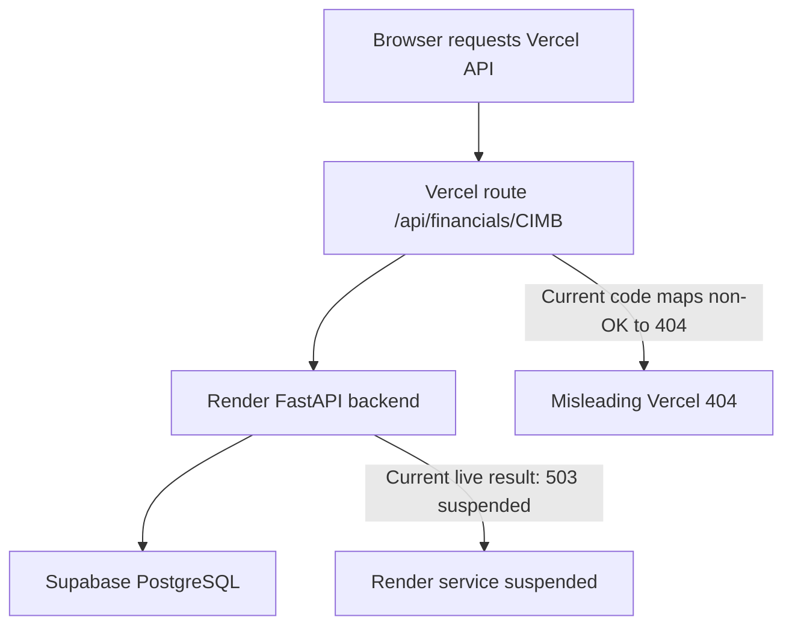

# Diagnose Backend Failure

## What The Current Error Means

The browser request reaches the Vercel API route successfully: `x-matched-path: /api/financials/[id]` proves `/api/financials/CIMB` exists on Vercel.

The real upstream backend currently fails directly:

- `https://finsight-api.onrender.com/health` returns `503 Service Unavailable`.
- Header: `x-render-routing: suspend-by-user`.
- Body: `This service has been suspended by its owner.`

So the immediate problem is the Render backend service, not Supabase data and not the `/companies/CIMB/advanced` page.

## Code Issue Masking The Real Error

The Vercel BFF route currently turns any backend non-OK response into a fake 404:

```ts
if (!res.ok) {
  return NextResponse.json(
    { error: `Financials for '${ticker}' not found` },
    { status: 404 }
  );
}
```

This is in [`frontend/src/app/api/financials/[id]/route.ts`](frontend/src/app/api/financials/%5Bid%5D/route.ts). If Render returns 503, Supabase returns 500, or auth/env config is wrong, the browser still sees 404. That makes debugging misleading.

## What To Change

1. Unsuspend or restart the Render service `finsight-api` first.
   - In Render dashboard, check whether the service is suspended manually, by billing/free-plan policy, or because the free instance expired/was disabled.
   - After enabling it, test `https://finsight-api.onrender.com/health` before testing Vercel.

2. Change [`frontend/src/app/api/financials/[id]/route.ts`](frontend/src/app/api/financials/%5Bid%5D/route.ts) so it forwards the backend status and response body.
   - If backend returns 503, Vercel should return 503.
   - If backend returns FastAPI 404 for missing company/financial rows, Vercel should return that actual 404 detail.
   - If backend cannot be reached at all, keep returning 503 `Backend unavailable`.

3. Temporarily test the backend directly, bypassing Vercel.
   - `GET https://finsight-api.onrender.com/health`
   - `GET https://finsight-api.onrender.com/financials/CIMB/income-statement`
   - Only after these work, test `GET https://finsights-mauve.vercel.app/api/financials/CIMB`.

4. If Render is back online but the financials endpoint still fails, then test Supabase separately.
   - Check Render logs for `sqlalchemy.exc.OperationalError`, connection timeout, password/host errors, or missing table errors.
   - Verify Render `DATABASE_URL` points to the current Supabase pooled connection string.
   - Verify the `companies` and `income_statements` tables still contain `ticker = 'CIMB'`.

5. Optional but useful: add a backend database health endpoint.
   - Add a small `/health/db` or extend `/health` to run `SELECT 1` against PostgreSQL.
   - This separates “FastAPI is alive” from “Supabase is reachable”.

## Test Order



Recommended order:

1. Fix Render suspension.
2. Confirm backend `/health` returns 200.
3. Confirm backend `/financials/CIMB/income-statement` returns data.
4. Update Vercel BFF route to preserve upstream errors.
5. Redeploy Vercel and retest the page.