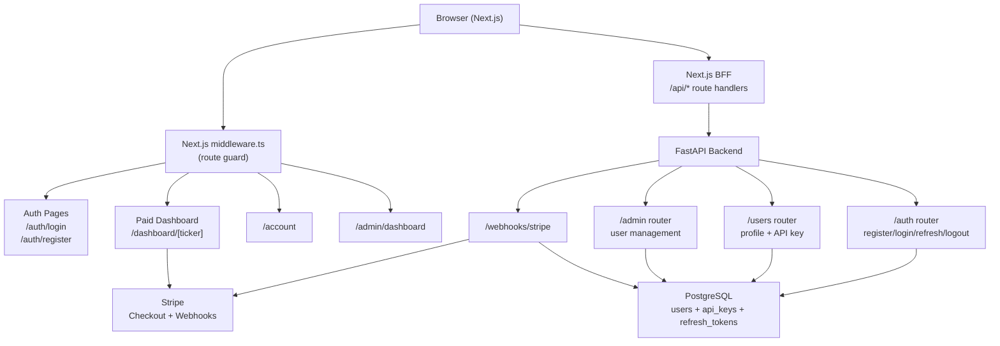

# Phase 4: Full-Stack Dashboard, Auth, RBAC & Stripe

## Architecture Overview



## Key Files

**Backend (new/modified):**
- [`src/backend/models.py`](src/backend/models.py) — add `User`, `RefreshToken`, `APIKey` models
- `src/backend/auth/jwt.py` — JWT create/verify utilities
- `src/backend/auth/password.py` — bcrypt hash/verify
- `src/backend/auth/dependencies.py` — FastAPI `Depends` for RBAC (`get_current_user`, `require_role`, `verify_api_key`)
- `src/backend/routers/auth.py` — `/auth/register`, `/auth/login`, `/auth/refresh`, `/auth/logout`
- `src/backend/routers/users.py` — `/users/me`, `/users/me/api-key`, `/users/me/api-key/rotate`
- `src/backend/routers/admin.py` — `/admin/users`, `/admin/users/{id}` PATCH/DELETE
- `src/backend/routers/webhooks.py` — `POST /webhooks/stripe`
- [`src/backend/main.py`](src/backend/main.py) — register new routers, add cookie middleware
- `src/backend/alembic/` — migration setup + `001_add_auth_tables.py`
- [`src/backend/requirements.txt`](src/backend/requirements.txt) — new deps

**Frontend (new/modified):**
- `frontend/src/middleware.ts` — Next.js edge middleware for route protection
- `frontend/src/stores/authStore.ts` — Zustand auth store
- `frontend/src/hooks/useAuth.ts` — TanStack Query auth hooks
- `frontend/src/app/auth/login/page.tsx` and `register/page.tsx`
- `frontend/src/app/dashboard/page.tsx` and `[ticker]/page.tsx`
- `frontend/src/app/account/page.tsx`
- `frontend/src/app/admin/dashboard/page.tsx`
- `frontend/src/app/upgrade/page.tsx`
- `frontend/src/components/charts/SentimentOverlayChart.tsx`
- `frontend/src/components/charts/PeerRadarChart.tsx`
- `frontend/src/components/charts/WaterfallChart.tsx`
- `frontend/src/lib/api.ts` — add auth API calls, Stripe redirect helper

**Docs (updated):**
- [`docs/api-reference/authentication.md`](docs/api-reference/authentication.md) — replace placeholder with real JWT + API key auth docs
- [`docs/backend/database-schema.md`](docs/backend/database-schema.md) — add User, APIKey, RefreshToken to ER diagram and table descriptions
- [`docs/frontend/architecture.md`](docs/frontend/architecture.md) — update structure, add new pages, auth flow diagram
- [`docs/frontend/dashboard.md`](docs/frontend/dashboard.md) — add paid-tier chart components (Sentiment Overlay, Radar, Waterfall)
- [`docs/frontend/state-management.md`](docs/frontend/state-management.md) — complete `useAuthStore`, caching strategy, optimistic updates
- `docs/backend/authentication.md` (**new**) — JWT implementation details, cookie config, token lifecycle
- `docs/backend/rbac.md` (**new**) — RBAC matrix, role enforcement code patterns
- `docs/backend/stripe-integration.md` (**new**) — Stripe Checkout flow, webhook handler, subscription lifecycle
- [`mkdocs.yml`](mkdocs.yml) — add the three new backend doc pages to nav

---

## Step-by-Step Implementation

### Step 1 — Backend: New Dependencies
Add to `src/backend/requirements.txt`:
```
python-jose[cryptography]==3.3.0
passlib[bcrypt]==1.7.4
stripe==10.5.0
alembic==1.14.0
python-multipart==0.0.9
```

### Step 2 — Backend: Database Models
Extend [`src/backend/models.py`](src/backend/models.py) with three new tables:
```python
class User(Base):
    __tablename__ = "users"
    id = Column(Integer, primary_key=True)
    email = Column(String(255), unique=True, nullable=False, index=True)
    hashed_password = Column(String(255), nullable=False)
    role = Column(String(20), default="free")   # free | paid | admin
    stripe_customer_id = Column(String(100), nullable=True)
    stripe_subscription_id = Column(String(100), nullable=True)
    is_active = Column(Boolean, default=True)
    created_at = Column(DateTime, default=datetime.utcnow)

class RefreshToken(Base):
    __tablename__ = "refresh_tokens"
    id = Column(Integer, primary_key=True)
    user_id = Column(Integer, ForeignKey("users.id", ondelete="CASCADE"))
    token_hash = Column(String(255), unique=True, nullable=False)
    expires_at = Column(DateTime, nullable=False)
    revoked = Column(Boolean, default=False)

class APIKey(Base):
    __tablename__ = "api_keys"
    id = Column(Integer, primary_key=True)
    user_id = Column(Integer, ForeignKey("users.id", ondelete="CASCADE"))
    key_hash = Column(String(255), unique=True, nullable=False)
    key_prefix = Column(String(10), nullable=False)  # first 8 chars for display
    created_at = Column(DateTime, default=datetime.utcnow)
    revoked = Column(Boolean, default=False)
```

### Step 3 — Backend: Alembic Setup & Migration
- Run `alembic init src/backend/alembic` and configure `env.py` to import `Base` from `models.py`.
- Generate migration: `alembic revision --autogenerate -m "add_auth_tables"`.
- Run `alembic upgrade head` in CI/CD and local dev.

### Step 4 — Backend: Auth Utilities
**`src/backend/auth/jwt.py`** — `create_access_token(data, expires_delta)`, `create_refresh_token(data)`, `decode_token(token)` using `python-jose`. Access token TTL: 15 min. Refresh token TTL: 7 days.

**`src/backend/auth/password.py`** — `hash_password(plain)`, `verify_password(plain, hashed)`, `generate_secure_password()` using `secrets.token_urlsafe(16)`.

**`src/backend/auth/dependencies.py`** — Three reusable `Depends`:
- `get_current_user` — reads `access_token` HttpOnly cookie, decodes JWT, returns `User`
- `require_role(*roles)` — raises `403` if user role not in allowed set
- `verify_api_key` — reads `X-API-Key` header, looks up hash in `api_keys` table

### Step 5 — Backend: Auth Router
`POST /auth/register` — generate password, hash it, store `User(role="free")`, return `{email, generated_password}` (shown once only).
`POST /auth/login` — verify password, set two `Set-Cookie` headers (HttpOnly `access_token` + `refresh_token`).
`POST /auth/refresh` — read refresh token cookie, verify, rotate to new access token.
`POST /auth/logout` — revoke refresh token in DB, clear both cookies.

All cookies: `HttpOnly=True`, `Secure=True`, `SameSite=Lax`, `Path=/`.

### Step 6 — Backend: Users & Admin Routers
**`/users/me`** — `GET` returns user profile; requires `get_current_user`.
**`/users/me/api-key`** — `GET` returns `{prefix, created_at}` for paid/admin only; `POST /rotate` revokes old key, issues new one.

**`/admin/users`** — `GET` returns paginated user list with `email`, `role`, `created_at`, `stripe_subscription_id`; requires `require_role("admin")`.
**`/admin/users/{id}`** — `PATCH` for tier/role updates; `DELETE` for account deletion.

### Step 7 — Backend: Stripe Webhook
`POST /webhooks/stripe` — verify `Stripe-Signature` header using `stripe.Webhook.construct_event`. Handle:
- `invoice.payment_succeeded` → set `User.role = "paid"`, generate API key
- `customer.subscription.deleted` → set `User.role = "free"`, revoke API keys

### Step 8 — Backend: Gate Existing Routes
Add `Depends(verify_api_key_or_session)` to `search.py` router for `POST /search` (paid + admin only per RBAC matrix). All other GET company/financial routes stay public (matching free-tier access).

### Step 9 — Frontend: Dependencies
In `frontend/`:
```bash
npm install @stripe/stripe-js zustand @tanstack/react-query
# (already installed per docs, verify)
npm install js-cookie @types/js-cookie
```

### Step 10 — Frontend: Zustand Auth Store
`frontend/src/stores/authStore.ts`:
```typescript
interface AuthStore {
  user: { id: number; email: string; role: "free" | "paid" | "admin" } | null;
  isLoading: boolean;
  setUser: (user: AuthStore["user"]) => void;
  clearUser: () => void;
}
```
Store is hydrated by a `useEffect` in the root layout that calls `GET /users/me` on mount.

### Step 11 — Frontend: Auth Pages
- `/auth/register` — email input → POST `/auth/register` → modal/overlay showing the generated password once with a "copy" button.
- `/auth/login` — email + password → POST `/auth/login` → redirect to `/dashboard`.

### Step 12 — Frontend: Next.js Middleware
`frontend/src/middleware.ts` — runs at the edge on `/dashboard/**`, `/account`, `/admin/**`. Reads the `access_token` cookie. If missing/expired, redirects to `/auth/login`. For `/admin/**`, additionally decodes the JWT payload and checks `role === "admin"`.

### Step 13 — Frontend: Paid Dashboard Pages
- `/dashboard` — overview grid of all 8 companies, shows upgrade CTA for free users (middleware already blocks non-paid, but component also renders correctly for admin).
- `/dashboard/[ticker]` — three paid chart components below the existing free-tier charts.

### Step 14 — Frontend: Paid Chart Components
- **`SentimentOverlayChart.tsx`** — Recharts `ComposedChart` with a `Line` for stock price and a `Bar` for AI sentiment score (mocked from `QualitativeInsight.future_outlook` until Phase 5 delivers real scores).
- **`PeerRadarChart.tsx`** — Recharts `RadarChart` across 5 axes (Liquidity, D/E, Profit Margin, Asset Turnover, ROE) comparing selected company vs peers.
- **`WaterfallChart.tsx`** — Recharts `BarChart` with custom positive/negative bars showing the revenue → gross profit → operating income → net income waterfall.

### Step 15 — Frontend: Account, Admin & Upgrade Pages
- `/account` — shows email, role badge, API key prefix, "Rotate key" button (paid only), "Upgrade" button (free only).
- `/upgrade` — pricing cards (Free vs Pro MYR 29/mo), Stripe Checkout redirect via `loadStripe` + `redirectToCheckout`.
- `/admin/dashboard` — TanStack Query table with all users, inline role/tier dropdowns, delete button.

### Step 16 — Documentation Updates

**Update existing docs:**
- [`docs/api-reference/authentication.md`](docs/api-reference/authentication.md) — replace "Phase 3 open API" notice with full JWT cookie auth flow, API key header usage, rate limit table.
- [`docs/backend/database-schema.md`](docs/backend/database-schema.md) — add `users`, `refresh_tokens`, `api_keys` to ER diagram; fill in all table descriptions; add Alembic section.
- [`docs/frontend/architecture.md`](docs/frontend/architecture.md) — update project structure tree with new pages; add auth flow sequence diagram; update rendering strategy table.
- [`docs/frontend/dashboard.md`](docs/frontend/dashboard.md) — add "Paid Tier" section documenting `SentimentOverlayChart`, `PeerRadarChart`, `WaterfallChart`; add RBAC access control table.
- [`docs/frontend/state-management.md`](docs/frontend/state-management.md) — complete `useAuthStore` interface; add `staleTime`/`gcTime` config table; document auth query keys.

**Create new docs:**
- `docs/backend/authentication.md` — JWT lifecycle (15 min access / 7 day refresh), cookie config (`HttpOnly`, `Secure`, `SameSite=Lax`), registration password-generation flow, logout/revocation flow.
- `docs/backend/rbac.md` — RBAC matrix table, `require_role` dependency pattern, how API key ties to user tier.
- `docs/backend/stripe-integration.md` — Checkout session creation, webhook verification, subscription lifecycle state machine.

**Update `mkdocs.yml`** — add the three new backend pages under the `Backend:` nav section.

---

## Code Documentation Standard
Every new Python module must have:
- Module-level docstring explaining purpose and key exports.
- Function/class docstrings using Google-style (`Args:`, `Returns:`, `Raises:`).
- Inline comments only for non-obvious security decisions (e.g. why `SameSite=Lax`).

Every new TypeScript file must have:
- JSDoc `/** */` on all exported functions and hooks.
- `interface` and `type` definitions with brief inline comments for non-obvious fields.
