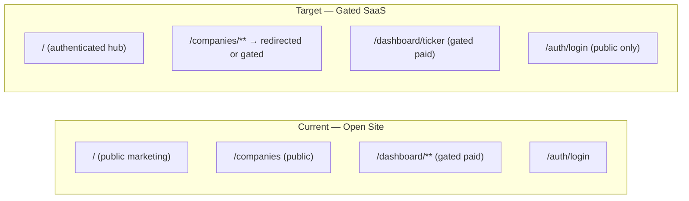

# Phase 4 Frontend SaaS Gating

## Current vs Target Architecture



## Database Schema Verification

The backend DB is **fully up to date**. `models.py` and `docs/backend/database-schema.md` both contain all Phase 4 tables (`users`, `refresh_tokens`, `api_keys`) with correct columns, FK constraints, and Alembic migration `001_add_auth_tables.py`. **No database or DB-doc changes required.**

---

## 1. Middleware — `frontend/src/middleware.ts`

**Current:** Only matches `/dashboard/:path*`, `/account/:path*`, `/admin/:path*`.

**Change:** Replace the matcher with a single negative-lookahead that covers every route **except** `/auth/**` and `/api/**`.

```ts
export const config = {
  matcher: ["/((?!auth|api|_next/static|_next/image|favicon.ico).*)"],
};
```

The middleware logic gains a global unauthenticated check **before** any role-specific checks:

```ts
// Global gate — any unrecognised/no-cookie user → login
if (!isAuthenticated) {
  const url = req.nextUrl.clone();
  url.pathname = "/auth/login";
  url.searchParams.set("redirect", pathname);
  return NextResponse.redirect(url);
}
// Then existing admin / dashboard / account role checks follow ...
```

Additionally, authenticated users who land on `/auth/login` or `/auth/register` are redirected to `/` (prevents logged-in users from seeing the auth pages).

---

## 2. Root Page — `frontend/src/app/page.tsx`

**Current:** 250-line public marketing/landing page.

**Change:** Replace entirely with a `"use client"` authenticated hub that uses `useAuthStore` and `useCurrentUser`. Rendered content is gated by role:

- **Free role:** Company grid (read-only tiles), all analytics links are locked with an upgrade CTA overlay
- **Paid / Admin:** Full company grid with links to `/dashboard/[ticker]` for advanced analytics
- **Admin:** Additional "Admin Dashboard →" quick-link card

The existing company grid JSX from `dashboard/page.tsx` (which becomes redundant) is moved here.

After this change, `app/dashboard/page.tsx` becomes a simple `redirect("/")` (or is deleted) since the hub functionality lives at `/`.

`useLogin` in `hooks/useAuth.ts` is updated to `router.push("/")` instead of `router.push("/dashboard")`.

---

## 3. Header — `frontend/src/components/layout/Header.tsx`

**Current:** Static nav with no auth awareness; no login/logout buttons.

**Change:** Import `useAuthStore` and `useLogout`. The right side of the header becomes role-aware:

- **Not authenticated / hydrating:** Show "Sign In" + "Get Started" buttons linking to `/auth/login` and `/auth/register`
- **Authenticated:** Show role badge, user email (truncated), "Account" link, and "Log Out" button (calls `useLogout`)

Dynamic nav links:

| Role | Extra nav links shown |
|------|----------------------|
| free | "Upgrade to Pro" |
| paid | "Pro Analytics" → `/` |
| admin | "Pro Analytics" + "Admin" → `/admin/dashboard` |

The ticker search bar is retained.

---

## 4. Session Hydration — `frontend/src/lib/providers.tsx`

**Current:** Only wraps with `QueryClientProvider`. Auth store hydration currently only happens on pages that explicitly call `useCurrentUser` — meaning a page refresh on the root or companies page doesn't hydrate the store.

**Change:** Add a lightweight `SessionHydrator` client component (renders nothing) that calls `useCurrentUser()` inside `Providers`. This guarantees the Zustand auth store is populated on every page load, not just on pages that opt in.

```tsx
function SessionHydrator() {
  useCurrentUser();
  return null;
}

export function Providers({ children }) {
  // ...
  return (
    <QueryClientProvider client={queryClient}>
      <SessionHydrator />
      {children}
    </QueryClientProvider>
  );
}
```

---

## 5. Documentation Updates

### `docs/frontend/architecture.md`
- Update project structure tree to remove `/` as "Landing page (SSG)" — rename to "Authenticated hub (CSR)"
- Update Rendering Strategy table: `/` changes from `SSG` to `CSR`
- Update the Mermaid auth flow sequence to show redirect from `/` instead of `/dashboard`
- Add a new "Route Protection" section summarising the new middleware matcher

### `docs/frontend/state-management.md`
- Add section documenting `SessionHydrator` and why it exists (store hydration on every render, not just opted-in pages)

### `docs/frontend/dashboard.md`
- Update to reflect that `/` is now the main authenticated hub
- Clarify that `/dashboard/[ticker]` is the paid per-company analytics route

### New: `docs/frontend/routing.md`
- New doc: covers the Edge Middleware strategy, the public/protected route split, role-specific redirect rules, and how the `access_token` cookie is used without signature verification at the edge

### `mkdocs.yml`
- Add `Routing: frontend/routing.md` under the Frontend nav section

---

## Files Changed Summary

- [`frontend/src/middleware.ts`](frontend/src/middleware.ts) — expand matcher, add global auth gate
- [`frontend/src/app/page.tsx`](frontend/src/app/page.tsx) — replace with CSR authenticated hub
- [`frontend/src/app/dashboard/page.tsx`](frontend/src/app/dashboard/page.tsx) — replace with redirect to `/`
- [`frontend/src/hooks/useAuth.ts`](frontend/src/hooks/useAuth.ts) — change post-login redirect from `/dashboard` to `/`
- [`frontend/src/components/layout/Header.tsx`](frontend/src/components/layout/Header.tsx) — auth-aware profile section + logout
- [`frontend/src/lib/providers.tsx`](frontend/src/lib/providers.tsx) — add `SessionHydrator`
- [`docs/frontend/architecture.md`](docs/frontend/architecture.md) — update routing table + structure
- [`docs/frontend/state-management.md`](docs/frontend/state-management.md) — document SessionHydrator
- [`docs/frontend/dashboard.md`](docs/frontend/dashboard.md) — update hub description
- `docs/frontend/routing.md` — **new file**
- [`mkdocs.yml`](mkdocs.yml) — add routing.md to nav
