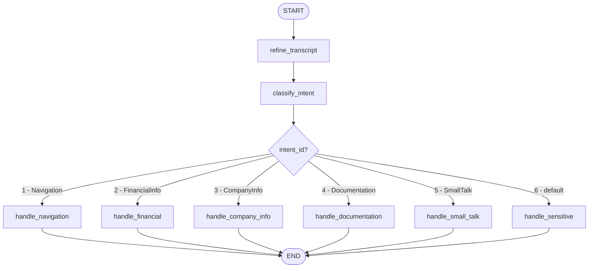

# Jarvis Implementation Status

## Purpose
This document records what has already been implemented for Jarvis and what is still pending.

---

## Completed Implementation

### 1) Intent Engine Architecture
- `JARVIS_INTENT_ENGINE` strategy is implemented with three modes:
  - `langgraph` (primary)
  - `keyword` (fallback)
  - `dify` (legacy compatibility)
- Engine-level fallback behavior is implemented in `src/backend/services/jarvis_intent.py`.

### 2) LangGraph Pipeline (Core Flow)
- LangGraph pipeline is implemented in `src/backend/services/langgraph_intent.py`.
- Flow is wired as:
  - `refine_transcript`
  - `classify_intent`
  - route by `intent_id`
  - intent-specific handler output
- Structured output schema is implemented via Pydantic (`IntentOutput`, `IntentEntities`).

### 2.1) LangGraph Design View (Handover Reference)
This is the design-level view from `.cursor/plans/langgraph_intent_engine_35044f04.plan.md` so another engineer can step in quickly.

State contract used by the graph:
- `raw_transcript`
- `session_id`
- `refined_text`
- `intent_id`
- `intent_name`
- `confidence`
- `entities` (company, metric, time_period, navigation_target)
- `reasoning`
- `output` (final branch response)

Node responsibilities:
- `refine_transcript`: clean STT artifacts before classification.
- `classify_intent`: structured classification to one of six intents.
- `handle_navigation`: build route payload for company/page navigation.
- `handle_financial`: currently placeholder (main unfinished branch).
- `handle_company_info`: resolve company context and respond with grounded info.
- `handle_documentation`: retrieve docs context (RAG + file fallback) and respond.
- `handle_small_talk`: conversational branch.
- `handle_sensitive`: safe refusal branch.

Unified output schema returned to router/frontend:
- `action`: `"navigate"` or `"respond"`
- `target`: route path or `null`
- `message`: UI text response
- `voice`: TTS-friendly response
- `intent_id`: numeric intent
- `refined_transcript`: corrected transcript
- `sources`: citations list
- `confidence`: confidence score
- `engine`: `"langgraph"`

### 3) Implemented Intents
- **Intent 1: Navigation** - implemented (`handle_navigation`)
  - Maps company/entity to frontend route.
  - Returns navigation action payload.
- **Intent 3: Company Information** - implemented (`handle_company_info`)
  - Uses direct database lookup for company profile and related KPI context.
  - Falls back gracefully when context is unavailable.
- **Intent 4: Documentation** - implemented (`handle_documentation`)
  - Uses RAG + file-based documentation fallback.
  - Supports docs extraction flow from API docs sources.
- **Intent 5: Small Talk** - implemented (`handle_small_talk`)
  - Uses dedicated small-talk prompt and response style.
- **Intent 6: Sensitive Topic** - implemented (`handle_sensitive`)
  - Returns refusal/safe response behavior.

### 4) RAG Foundation for Jarvis
- RAG endpoint is implemented in `src/backend/routers/rag.py`:
  - `POST /rag/ask`
  - `GET /rag/health`
- Retrieval and answer generation services are wired (`rag_retriever`, `rag_answer`).
- RAG tests exist in `src/backend/tests/test_rag.py` (happy path, abstention, validation, health, and failures).

### 5) Documentation
- Jarvis documentation pages are present and updated under `docs/ai-systems/`:
  - `jarvis-overview.md`
  - `jarvis-intent-classifier.md`
  - deployment/API reference pages

---

## Not Completed / Partially Completed

### 1) Intent 2 Extension (FinancialInfo) - **Not Finished**
Current state:
- `handle_financial` in `src/backend/services/langgraph_intent.py` is still a placeholder.
- It returns a "coming soon" response instead of actual financial retrieval + grounded answer.

What is missing:
- Real financial data retrieval path for metrics (for example: P/E, EPS, revenue, net income).
- Entity normalization and metric mapping from natural language.
- Time-period resolution (for example: last year, latest quarter, FY2023).
- Grounded response generation with source references and confidence handling.
- Proper fallback behavior when data is missing.

### 2) End-to-End Intent 2 Validation
- No full E2E test coverage is visible for true FinancialInfo execution.
- Need integration tests for:
  - metric questions
  - ticker + metric + time period combinations
  - low-confidence / ambiguous financial queries

### 3) Production Hardening (Recommended)
- Add telemetry/monitoring specifically for per-intent success and fallback rates.
- Add regression suite for common STT artifacts on financial terms.
- Add intent confusion tests for 2 vs 3 boundary cases.

---

## Suggested Next Completion Tasks (Intent 2)
1. Implement `handle_financial` with real backend data query path.
2. Add metric and time-period parser utilities.
3. Return structured response with sources + confidence.
4. Add unit + integration tests for financial queries.
5. Update Jarvis docs after feature completion to mark Intent 2 as fully supported.

---

## Current Overall Status
- Jarvis architecture and most intent routing are implemented.
- **Main remaining gap: Intent 2 (FinancialInfo) extension is not complete yet.**

