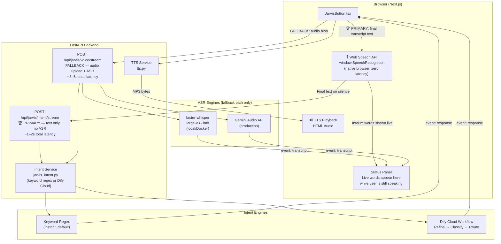

# Jarvis — Architecture & Pipeline

## Two-Path Design

Jarvis uses **two paths** depending on browser support:

| Path | Trigger | Transcription | Latency |
|------|---------|---------------|---------|
| **Primary** | Web Speech API available (Chrome/Edge) | Browser-native, live word-by-word | **~50ms** live + ~1–2s intent |
| **Fallback** | Web Speech API unavailable (Firefox) | faster-whisper or Gemini ASR | ~1–3s ASR + ~1–2s intent |

---

## System Architecture



---

## Request / Response Lifecycle

### 🏆 Primary Path — Web Speech API (Chrome/Edge)

```
1. User clicks mic → window.SpeechRecognition.start()
2. Browser streams words to panel in real-time as user speaks:
   interim: "naviga"              → dim text, blinking cursor
   interim: "navigate to May"     → updating live
   final:   "navigate to Maybank" → committed bright text
3. User pauses → 2s silence timer → recognition.stop()
4. POST /api/jarvis/intent/stream (FormData: text="navigate to Maybank")
   ↳ NO audio upload, NO ASR — just the text string
5. Backend: keyword regex match → instant result
   OR Dify Cloud: ~1–2s for intent classification
6. SSE event: response → { action: "navigate", target: "/companies/MAYBANK" }
7. Frontend navigates + plays TTS

Total time from 'stop speaking' to navigation:
  ~200ms (keyword engine) or ~1.5s (Dify)
```

### Fallback Path — Audio Upload (Firefox / mobile)

```
1. User clicks mic → MediaRecorder.start()
2. User clicks stop → Blob(chunks, audio/webm)
3. POST /api/jarvis/voice/stream (FormData: file, stop_reason)
4. Backend runs ASR (1–3s)
5. SSE event: transcript → { text: "navigate to Maybank" }  ← shown in panel
6. Backend runs intent classifier
7. SSE event: response → { action: "navigate", ... }

Total time from 'stop speaking' to navigation: ~3–6s
```

---

## Component Map

### Backend

| File | Purpose |
|------|---------|
| `routers/jarvis.py` | FastAPI router — `/intent/stream` (primary) + `/voice/stream` (fallback) + TTS |
| `services/asr.py` | Dual ASR engine: faster-whisper (local) / Gemini (cloud) — fallback path only |
| `services/jarvis_intent.py` | Intent routing: keyword regex (instant) + Dify Cloud client |
| `services/tts.py` | Text-to-speech: edge-tts (local) / Google Cloud TTS |

### Frontend

| File | Purpose |
|------|---------|
| `components/ui/JarvisButton.tsx` | Full Jarvis UI — Web Speech API live transcription, SSE intent, TTS playback |

---

## Latency Budget

### Primary Path (Web Speech API — Chrome/Edge)

| Stage | Latency | Notes |
|-------|---------|-------|
| First word appears in panel | **~50ms** | Browser-native, real-time |
| User stops speaking | 0ms | Auto-detected via 2s silence |
| POST text to `/intent/stream` | ~20ms | Just a text string |
| Keyword intent (local regex) | **~5ms** | Pure regex, no network |
| Dify intent (cloud) | ~1–2s | 2 LLM calls (refine + classify) |
| TTS synthesis + playback | ~400ms | edge-tts |
| **Total (keyword engine)** | **~100ms** | Effectively instant |
| **Total (Dify engine)** | **~1.5–3s** | |

### Fallback Path (Audio Upload — Firefox / mobile)

| Stage | Latency | Notes |
|-------|---------|-------|
| Audio upload | 50–200ms | |
| ASR faster-whisper CPU | 1–3s | large-v3 + int8 |
| ASR Gemini Audio API | 300–800ms | Cloud |
| Transcript shown in panel | **~1–3s** | SSE `event: transcript` |
| Keyword intent | ~5ms | |
| Dify intent | ~1–2s | |
| **Total (keyword)** | **~1–3s** | |
| **Total (Dify)** | **~3–6s** | |

---

## Browser Compatibility

| Browser | Web Speech API | Path Used |
|---------|---------------|-----------|
| Chrome 33+ | ✅ | Primary (live transcription) |
| Edge 79+ | ✅ | Primary (live transcription) |
| Safari 14.1+ | ⚠️ Partial | Primary (may need prefix) |
| Firefox | ❌ | Fallback (audio upload) |
| Mobile Chrome | ✅ | Primary |
| Mobile Safari | ⚠️ Partial | Primary |

---

## Intent Classification

Jarvis uses a **3-stage pipeline** in Dify Cloud:

1. **Transcript Refinement** — Gemini 2.0 Flash fixes STT artifacts (`"navigate the Maybank"` → `"navigate to Maybank"`)
2. **Intent Classifier** — Gemini 1.5 Pro outputs structured JSON with `intent_id`, entities, and confidence
3. **JSON Parser (Code Node)** — validates the output and extracts `intent_id` safely

See the [Intent Classifier Prompt](./jarvis-intent-classifier.md) for the full system prompt and few-shot examples.
