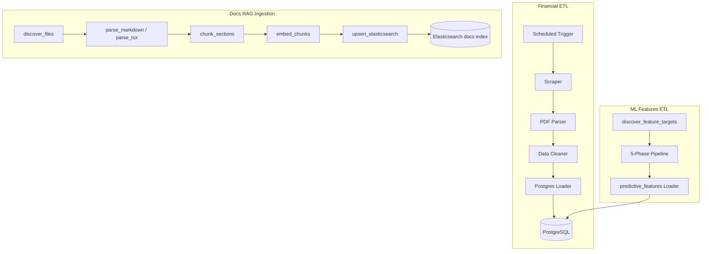

# Data Pipeline Architecture

!!! success "Current MVP"
    The platform currently runs three production-oriented pipelines:
    1) financial PDF ingestion into PostgreSQL,
    2) ML feature computation into `predictive_features`, and
    3) documentation ingestion into Elasticsearch for RAG.

---

## Pipeline Overview



---

## Financial ETL Stages

### Stage 1 — Scraping

Collects annual/quarterly disclosures from supported Malaysian companies.

### Stage 2 — PDF Parsing

Extracts raw text/tables and section-level metadata from source PDFs.

### Stage 3 — Data Cleaning

Normalizes parsed content into consistent financial schemas.

### Stage 4 — Database Ingestion

Performs idempotent loads into PostgreSQL tables consumed by API endpoints.

### Stage 5 — ML Feature Computation (Implemented)

The **ML Features ETL** pipeline (`ml_features_etl` Airflow DAG) fetches
external market data, earnings surprises, KLSE shareholding trades, and sector
peer signals to compute **19 populated metrics** (of 21 schema columns) per
quarter into the `predictive_features` table.  Phase 5 currently writes
**metric 21 only** (`sector_peer_earnings_sentiment`); PDF-based metrics 19–20
are planned.

See [ML Features ETL](../data-engineering/ml-features-etl.md).

---

## Documentation RAG Ingestion Stages (Implemented)

### Stage 1 — Discover Files

`src/pipeline/nodes/doc_loader.py` recursively discovers:
- Markdown docs (`*.md`)
- API docs TSX page (`*/api-docs/page.tsx`) when enabled

### Stage 2 — Parse to Structured Sections

`src/pipeline/nodes/doc_parser.py` parses:
- Frontmatter (YAML)
- Heading hierarchies
- Obsidian links/tags
- API docs endpoint metadata extracted from TSX

### Stage 3 — Chunk Sections

`src/pipeline/nodes/doc_chunker.py` creates bounded chunks with overlap and stable IDs, then enriches each chunk with metadata and contextual prefixes.

### Stage 4 — Embed Chunks

`src/pipeline/nodes/doc_embedder.py` generates dense vectors using Gemini embedding models with batching and retry handling.

### Stage 5 — Upsert to Elasticsearch

`src/pipeline/nodes/doc_indexer.py` bulk-indexes chunks into the docs alias, skipping unchanged chunks by comparing `content_hash`.

---

## Pipeline Entry Point

Run the docs ingestion graph from CLI:

```bash
python -m pipeline.doc_graph --docs ./docs
```

Useful options:
- `--dry-run` to validate discovery/parsing/chunking without ES writes
- `--no-embed` to skip embedding and test non-vector flow

---

## Orchestration

Financial ETL orchestration remains scheduler-driven via `finsight_etl` (daily)
and `jobs.weekly_ingestion` (deployment path).

ML feature computation runs weekly via the `ml_features_etl` Airflow DAG
(Monday 09:00 MYT).

Docs ingestion currently runs via CLI/manual trigger and is designed to be
schedulable in the same orchestration layer.

---

## Output Schema

- Financial ETL outputs normalized relational records in PostgreSQL
  (`income_statements`, `kpi_summaries`, etc.).
- ML Features ETL outputs one row per `(ticker, fiscal_year, fiscal_quarter)`
  in `predictive_features` with 21 schema columns (**19 populated** by the
  current pipeline).
- Docs ingestion outputs chunked documents in Elasticsearch with:
  - source metadata (`source_path`, `doc_type`, `domain`, `ticker`)
  - lineage metadata (`doc_id`, `chunk_id`, previous/next chunk links)
  - retrieval fields (`content`, `content_vector`, `tags`, `heading_path`)
