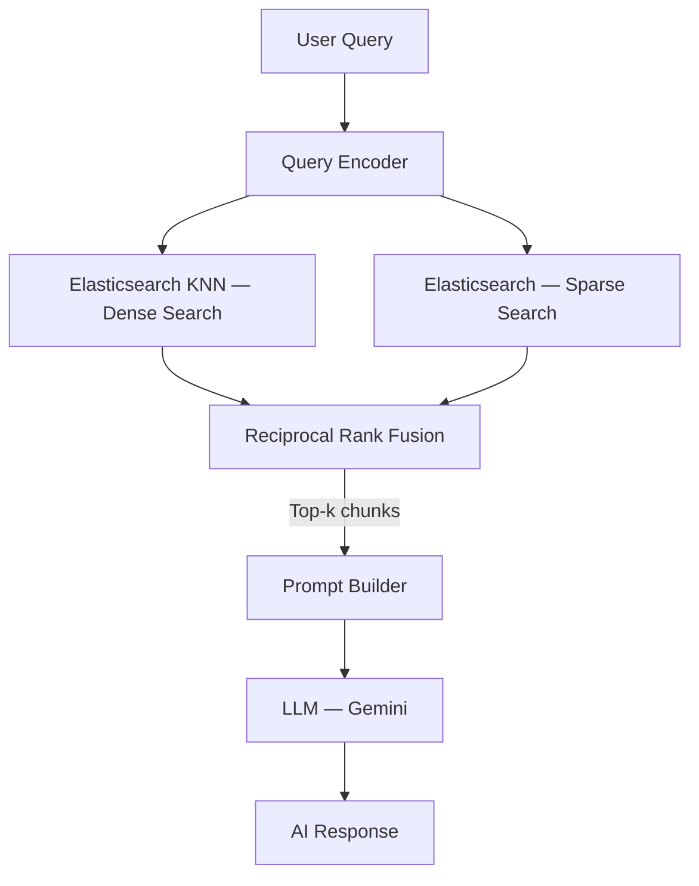

# RAG Architecture

!!! success "Current status"
    The hybrid RAG architecture below is implemented in the backend and ingestion pipeline.

---

## Overview

FinSight uses a **hybrid retrieval** strategy combining sparse BM25 and dense vector KNN in Elasticsearch. Retrieved chunks are fused with RRF and passed to Gemini for grounded answer generation.

---

## Architecture Diagram



---

## Retrieval Strategy

### Dense Retrieval (Elasticsearch KNN)

- Query is embedded with Gemini embeddings
- KNN runs on `content_vector`
- Candidate pool is configurable (`RAG_CANDIDATE_POOL`)
- Supports scoped metadata filters before retrieval

### Sparse Retrieval (Elasticsearch)

- BM25 `multi_match` over:
  - `title` (boosted)
  - `heading_path` (boosted)
  - `tags`
  - `content`
- Uses `best_fields` with tie breaker for mixed lexical relevance

### Reciprocal Rank Fusion

- Lexical and vector hit lists are merged with `1 / (k + rank)`
- Rank constant is configurable (`RAG_RRF_RANK_CONSTANT`)
- Top-k fused chunks are returned with per-query diagnostics

---

## Prompt Design

- System prompt enforces strict grounding to supplied chunks only
- Model abstains when context is insufficient
- Answers are concise and include references to retrieved headings/titles
- Implemented in `src/backend/services/rag_answer.py`

---

## Context Window Management

- Chunks are produced from parsed sections with bounded char length and overlap
- Chunk prefix includes title/section/tags for better semantic recall
- Metadata includes `doc_type`, `domain`, `ticker`, `source_path`, and lineage fields
- Chunk IDs are stable and deterministic for idempotent re-ingestion

---

## Observability

- `/rag/health` exposes ES availability and active model config
- Retrieval diagnostics (`lexical_hits`, `vector_hits`, `fused_hits`) are returned in API responses
- Startup bootstrap can ensure index + alias exists (`RAG_BOOTSTRAP_ES_INDEX`)
- Service logs include retrieval hit counts, abstention, and confidence

---

## Elasticsearch Index Mapping (v2)

The index versioned as `finsight_docs_v2` extends the RAG mapping with **edge n-gram autocomplete sub-fields** to support live search.

### Autocomplete Analyzers

| Analyzer | Used at | Behaviour |
|---|---|---|
| `autocomplete_index` | Index time | Standard tokenise → lowercase → edge n-gram (min 2, max 20 chars) |
| `autocomplete_search` | Query time | Standard tokenise → lowercase only (no n-gram expansion) |

### Sub-fields Added

| Field | Sub-field | Purpose |
|---|---|---|
| `title` | `title.autocomplete` | Prefix-match page titles (boost ×4 in live search) |
| `heading_path` | `heading_path.autocomplete` | Prefix-match section headings (boost ×2) |
| `content` | `content.autocomplete` | Prefix-match body text (boost ×1) |

The RAG BM25 and KNN paths are unaffected — they continue to use the root `title`, `heading_path`, and `content` fields with `english_analyzer`.

### Version Migration

Elasticsearch does not allow analyzer changes on an existing open index.  To upgrade:

```bash
# 1. Set the version env var (defaults to v2)
export ELASTICSEARCH_DOCS_INDEX_VERSION=v2

# 2. Reset the index (warning: deletes all indexed content)
python scripts/create_docs_index.py --reset

# 3. Re-run the ingestion pipeline
python src/pipeline/doc_graph.py
```
