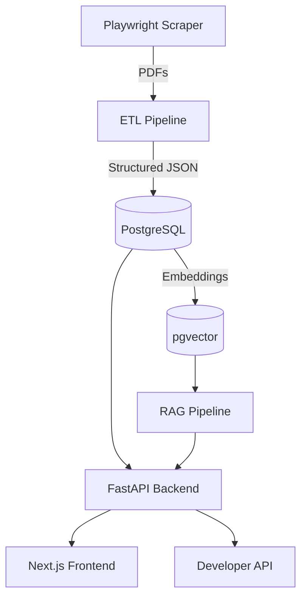
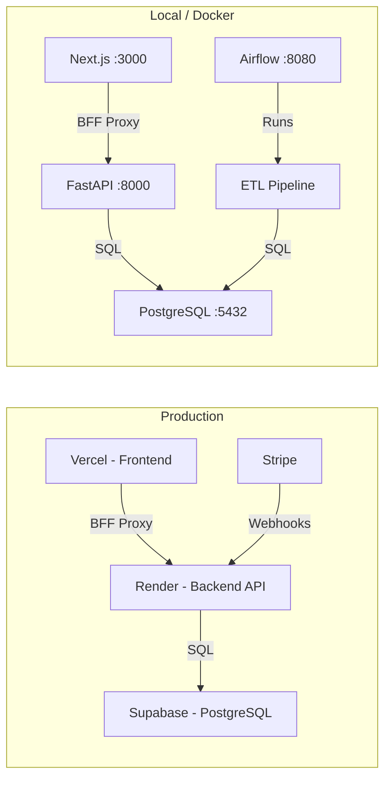
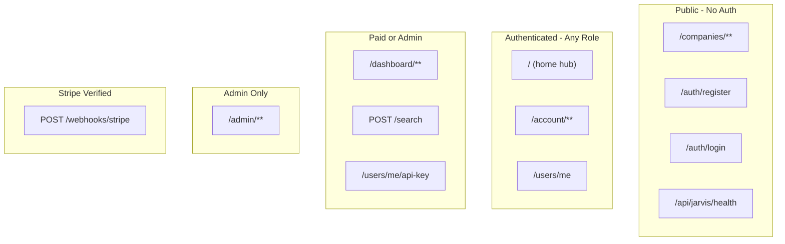

# System Architecture

!!! success "Phase 4 — Live"
    The production system spans a scraping layer, ETL pipeline, PostgreSQL database,
    FastAPI backend with authentication and RBAC, Stripe monetization, Jarvis voice
    assistant, and a Next.js frontend.

---

## High-Level Diagram

---

## Component Overview

| Component | Technology | Status |
|---|---|---|
| Web Scraper | Playwright + Stealth | ✅ Implemented |
| PDF Parser | LlamaParse + PyMuPDF fallback | ✅ Implemented |
| ETL Pipeline | LangGraph + Gemini + Langfuse | ✅ Implemented |
| Pipeline Orchestrator | Apache Airflow (LocalExecutor) | ✅ Implemented |
| Relational Database | PostgreSQL (Supabase) | ✅ Implemented |
| Backend API | FastAPI + SQLAlchemy | ✅ Implemented |
| Authentication | JWT (HttpOnly cookies) + bcrypt | ✅ Implemented |
| RBAC | Role-based (free/paid/admin) | ✅ Implemented |
| Monetization | Stripe Checkout + Webhooks | ✅ Implemented |
| Voice Assistant | Jarvis (ASR + NLU + TTS) | ✅ Implemented |
| Frontend | Next.js 15 + React 19 + Zustand | ✅ Implemented |
| Vector Store | pgvector | 🚧 Planned (Phase 5) |
| Search Engine | Elasticsearch | 🚧 Planned (Phase 5) |
| AI / RAG Layer | LangGraph + pgvector | 🚧 Planned (Phase 5) |
| Cache / Rate Limiter | Redis | 🚧 Planned (Phase 6) |
| ML Models | PyTorch / XGBoost | 🚧 Planned (Phase 6) |

---

## Service Boundaries

- **Frontend → Backend**: All API calls go through Next.js BFF route handlers (`/api/**`), which proxy to the FastAPI backend. The backend URL is never exposed to the browser.
- **Backend → Database**: SQLAlchemy ORM over PostgreSQL. Connection string via `DATABASE_URL`.
- **Stripe → Backend**: Webhook events (subscription lifecycle) are verified with `STRIPE_WEBHOOK_SECRET`.
- **Airflow → Pipeline**: PythonOperator tasks import and invoke `pipeline.graph.run_pipeline()` directly.

---

## Infrastructure Overview

### Production Stack

| Service | Platform | Configuration |
|---------|----------|---------------|
| Frontend | Vercel | Auto-deploys from `main` branch; root dir = `frontend/` |
| Backend | Render | Web service from `src/backend/render.yaml`; Python 3.12 |
| Database | Supabase | Managed PostgreSQL with connection pooling (Session mode) |
| CI/CD | GitHub Actions | `deploy-backend.yml`, `deploy-frontend.yml`, `deploy-docs-on-main.yml` |
| Documentation | GitHub Pages | MkDocs Material site built and deployed via Actions |

### Local Development Stack

| Service | Container | Port |
|---------|-----------|------|
| PostgreSQL | `postgres:16-alpine` | 5432 |
| Backend | Custom (Python 3.12-slim + ffmpeg) | 8000 |
| Frontend | Custom (Node 22-alpine, multi-stage) | 3000 |
| Airflow Metadata DB | `postgres:16-alpine` (separate) | 5433 |
| Airflow Webserver | `apache/airflow:2.9.3` | 8080 |
| Airflow Scheduler | `apache/airflow:2.9.3` | — |

---

## Security Boundaries

- **Authentication boundary**: JWT access tokens (15 min) in HttpOnly cookies. Refresh tokens (7 days) for rotation.
- **API key access**: `X-API-Key` header with SHA-256 hashed keys for programmatic access (paid/admin tier).
- **Frontend middleware**: Edge middleware decodes JWT for UX-level route guarding (not a security boundary — backend always re-verifies).
