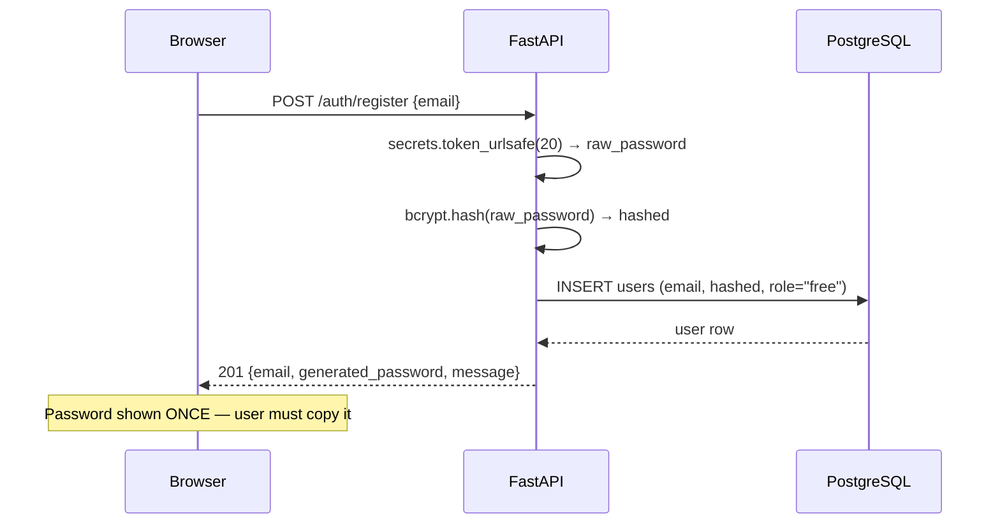
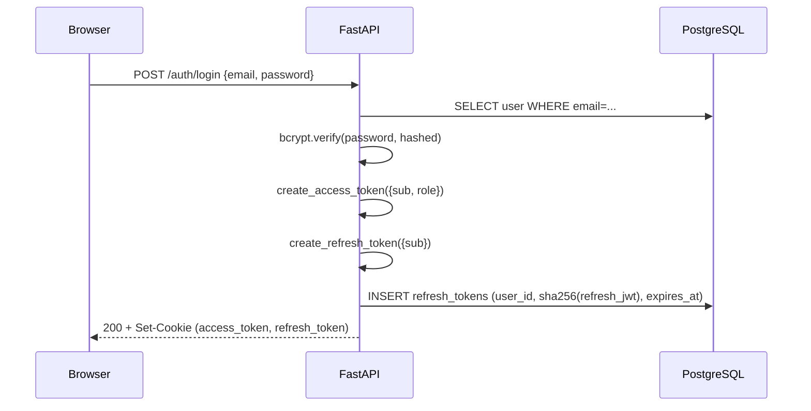
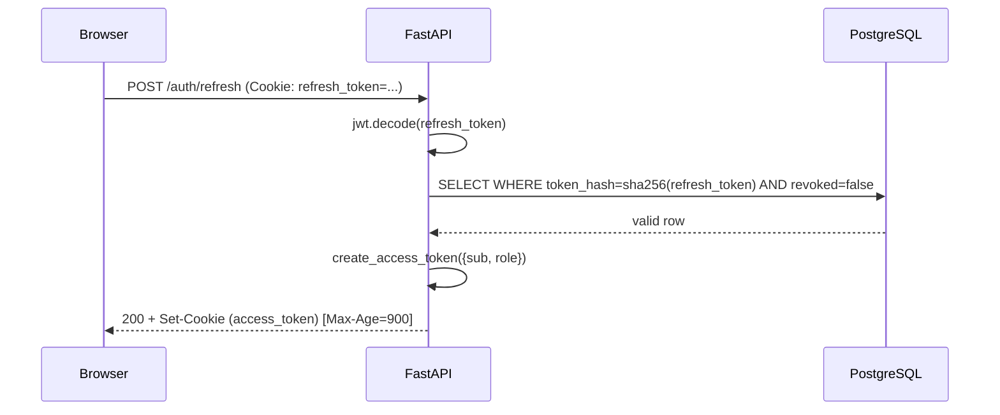

# Authentication

!!! success "Phase 4"
    JWT HttpOnly cookie authentication is implemented in `src/backend/auth/`.

---

## Overview

FinSight uses a dual-credential system:

| Credential | Intended for | Endpoint | Transport |
|---|---|---|---|
| JWT access + refresh cookies | Web browser dashboard | `/auth/**` | `Set-Cookie` header |
| Developer API key | Scripts, CI/CD, third-party clients | Any protected route | `X-API-Key` header |

---

## JWT Token Design

### Token Types

| Token | TTL | Payload fields | Storage |
|---|---|---|---|
| `access_token` | **15 minutes** | `sub`, `role`, `exp`, `type: "access"` | HttpOnly cookie |
| `refresh_token` | **7 days** | `sub`, `exp`, `type: "refresh"` | HttpOnly cookie + hash in DB |

Short access token TTL limits the damage from a cookie leakage window.
The refresh token is long-lived but validated against the database on every
use, so it can be revoked server-side instantly on logout or compromise.

### Cookie Security Attributes

```
Set-Cookie: access_token=<jwt>; HttpOnly; Secure; SameSite=Lax; Path=/; Max-Age=900
Set-Cookie: refresh_token=<jwt>; HttpOnly; Secure; SameSite=Lax; Path=/; Max-Age=604800
```

| Attribute | Why |
|---|---|
| `HttpOnly` | Prevents JavaScript from reading the token (blocks XSS token theft) |
| `Secure` | Only transmitted over HTTPS |
| `SameSite=Lax` | Blocks cross-site POST requests (CSRF) while allowing normal navigations |
| `Path=/` | Cookie is sent on all requests to the domain |

!!! warning "Local development — `Secure` flag"
    The `Secure` attribute prevents cookies from being set over plain HTTP
    (`http://localhost`).  In local development you **must** set
    `COOKIE_SECURE=false` in the backend's environment, otherwise login will
    appear to succeed but no cookies will be stored and subsequent
    authenticated requests will fail with 401.

    In production (HTTPS) leave `COOKIE_SECURE` unset (defaults to `true`).

### Signing

Tokens are signed with HS256 using the `SECRET_KEY` environment variable.
In production this must be a random 32-byte hex string:

```bash
openssl rand -hex 32
```

---

## Registration Flow



The backend never stores the plain-text password.  The generated password
uses `secrets.token_urlsafe` (OS CSPRNG; URL-safe base64 characters only).

---

## Login Flow



---

## Token Refresh Flow



---

## Logout Flow

```mermaid
sequenceDiagram
    participant Browser
    participant FastAPI
    participant DB as PostgreSQL

    Browser->>FastAPI: POST /auth/logout (Cookie: refresh_token=...)
    FastAPI->>DB: UPDATE refresh_tokens SET revoked=true WHERE hash=...
    FastAPI-->>Browser: 204 + Set-Cookie (access_token=; Max-Age=0) + Set-Cookie (refresh_token=; Max-Age=0)
```

---

## Implementation Reference

| File | Contents |
|---|---|
| `src/backend/auth/jwt.py` | `create_access_token`, `create_refresh_token`, `decode_token` |
| `src/backend/auth/password.py` | `hash_password`, `verify_password`, `generate_secure_password`, `hash_api_key`, `generate_api_key` |
| `src/backend/auth/dependencies.py` | `get_current_user`, `require_role`, `get_api_key_user`, `require_api_key_or_session` |
| `src/backend/routers/auth.py` | Route handlers with cookie management |

---

## Environment Variables

| Variable | Required | Default | Description |
|---|---|---|---|
| `SECRET_KEY` | **Yes** | `change-me-…` | JWT signing key — generate with `openssl rand -hex 32` |
| `ALGORITHM` | No | `HS256` | JWT algorithm |
| `COOKIE_SECURE` | No | `true` | Set to `false` for local HTTP (`http://localhost`) development |

## BFF Login Route — Full Profile Response

The Next.js BFF login route (`/api/auth/login`) does more than simply proxy
credentials.  After FastAPI sets the cookies, the BFF extracts the
`access_token` value from the `Set-Cookie` response header and calls
`GET /users/me` internally to fetch the complete `AuthUser` shape
`{id, email, role, has_api_key}`.

This is necessary because the bare FastAPI login response only returns
`{email, role, message}`, which is insufficient for the Zustand auth store
(which requires `id` and `has_api_key`).
