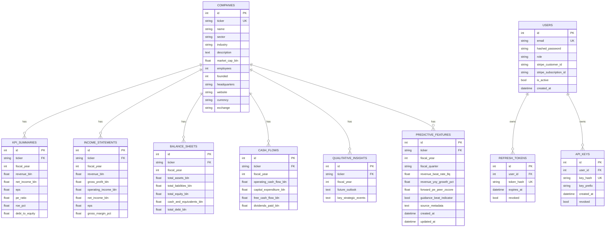

# Database Schema

!!! success "Phase 4 Updated"
    The core PostgreSQL schema for companies and financials was designed in
    Phase 2.  Phase 4 adds three new tables: ``users``, ``refresh_tokens``,
    and ``api_keys`` for authentication and RBAC.

---

## Entity Relationship Overview



---

## Tables

### `companies`

Central reference table.  All financial statement tables use `ticker` as a
foreign key rather than a numeric `company_id`, which simplifies queries and
API routing.

| Column | Type | Notes |
|---|---|---|
| `id` | `INTEGER PK` | Auto-increment |
| `ticker` | `VARCHAR(20) UNIQUE` | Exchange ticker (e.g. `MAYBANK`) |
| `name` | `VARCHAR(200)` | Full company name |
| `sector` / `industry` | `VARCHAR(100)` | GICS classification |
| `description` | `TEXT` | Company overview |
| `market_cap_bln` | `FLOAT` | Market cap in MYR billions |
| `employees` | `INTEGER` | Approximate headcount |
| `currency` | `VARCHAR(10)` | Default `MYR` |
| `exchange` | `VARCHAR(50)` | Default `KLSE` |

### `kpi_summaries`

One row per `(ticker, fiscal_year)`.  Unique constraint enforced.

| Column | Type | Notes |
|---|---|---|
| `revenue_bln` | `FLOAT` | Total revenue in MYR billions |
| `eps` | `FLOAT` | Earnings per share |
| `pe_ratio` | `FLOAT` | Nullable — not available for all companies |
| `roe_pct` | `FLOAT` | Return on equity % |
| `debt_to_equity` | `FLOAT` | Total debt / total equity |

### `income_statements`

One row per `(ticker, fiscal_year)`.

| Column | Type | Notes |
|---|---|---|
| `gross_margin_pct` | `FLOAT` | Computed: gross_profit / revenue × 100 |
| `operating_margin_pct` | `FLOAT` | Computed |
| `net_margin_pct` | `FLOAT` | Computed |

### `balance_sheets`

One row per `(ticker, fiscal_year)`.  All values in MYR billions.

### `cash_flows`

One row per `(ticker, fiscal_year)`.  `free_cash_flow_bln` = operating − capex.

### `qualitative_insights`

One row per `(ticker, fiscal_year)`.  `key_strategic_events` is stored as a
JSON string and parsed by the router before returning to the client.

### `predictive_features`

!!! success "ML Features ETL — Implemented"
    Populated by the five-phase ML feature pipeline
    (`src/scraper/ml_pipeline_runner.py`).  See
    [ML Features ETL](../data-engineering/ml-features-etl.md) for the full
    pipeline documentation.

One row per `(ticker, fiscal_year, fiscal_quarter)`.  The schema defines **21
computed metrics** for Phase 6 machine learning; **19 are populated today**.
Unique constraint: `(ticker, fiscal_year, fiscal_quarter)`.

| Column group | Metrics | Source phase | Populated |
|---|---|---|---|
| Earning surprises | `revenue_beat_rate_8q`, `eps_beat_rate_8q`, `avg_revenue_surprise_pct`, `avg_eps_surprise_pct`, `consecutive_double_beat_quarters` | Phase 3 (Investing.com → yfinance → i3investor) | Yes |
| Money flow | `net_institutional_cash_flow_myr`, `institutional_flow_to_market_cap_ratio`, `net_insider_trading_value_myr`, `options_iv_rank_pct` | Phase 4 (i3investor + Malaysia Warrants) | Yes |
| Fundamentals | `revenue_yoy_growth_pct`, `net_income_yoy_growth_pct`, `gross_margin_delta_qoq_pct`, `operating_margin_delta_qoq_pct`, `fcf_yield_pct` | Phase 1 (yfinance + i3investor margins) | Yes |
| Valuation | `forward_pe_peer_zscore`, `forward_pe_peer_discount_pct`, `forward_ps_ratio`, `peg_ratio` | Phase 2 (yfinance + TradingView trailing PE peers) | Yes |
| Forward-looking | `guidance_beat_indicator`, `backlog_order_book_yoy_growth_pct` | Phase 5 (planned — PDF regex) | No |
| Forward-looking | `sector_peer_earnings_sentiment` | Phase 5 (TradingView peers + Phase 3 cache; revenue beat, EPS fallback) | Yes |

Additional columns:

| Column | Type | Notes |
|---|---|---|
| `source_metadata` | `TEXT` | JSON string: source URLs, file paths, phase timestamps |
| `created_at` | `DATETIME` | Row creation timestamp (UTC) |
| `updated_at` | `DATETIME` | Last UPSERT timestamp (UTC) |

---

## Auth Tables (Phase 4)

### `users`

Registered accounts.

| Column | Type | Notes |
|---|---|---|
| `email` | `VARCHAR(255) UNIQUE` | Indexed; login identifier |
| `hashed_password` | `VARCHAR(255)` | bcrypt hash (via passlib) |
| `role` | `VARCHAR(20)` | `free` \| `paid` \| `admin`; default `free` |
| `stripe_customer_id` | `VARCHAR(100)` | Nullable; set when Stripe customer is created |
| `stripe_subscription_id` | `VARCHAR(100)` | Nullable; set when subscription is active |
| `is_active` | `BOOLEAN` | Soft-disable without deleting; default `true` |
| `created_at` | `DATETIME` | UTC timestamp |

### `refresh_tokens`

Long-lived tokens persisted as hashes for server-side revocation.

| Column | Type | Notes |
|---|---|---|
| `user_id` | `INTEGER FK → users.id` | `ON DELETE CASCADE` |
| `token_hash` | `VARCHAR(255) UNIQUE` | SHA-256 hex of the raw JWT string |
| `expires_at` | `DATETIME` | 7 days after creation |
| `revoked` | `BOOLEAN` | Set to `true` on logout |

### `api_keys`

Developer API keys for programmatic access (paid/admin tier).

| Column | Type | Notes |
|---|---|---|
| `user_id` | `INTEGER FK → users.id` | `ON DELETE CASCADE` |
| `key_hash` | `VARCHAR(64) UNIQUE` | SHA-256 hex of the raw `fsk_…` key |
| `key_prefix` | `VARCHAR(10)` | First 8 chars — safe to display in UI |
| `revoked` | `BOOLEAN` | Set to `true` on rotation or downgrade |

---

## Migrations (Alembic)

Phase 4 introduces Alembic for database migrations.

**Setup:**
```bash
cd src/backend
alembic upgrade head
```

**Creating a new migration:**
```bash
alembic revision --autogenerate -m "describe_the_change"
alembic upgrade head
```

**Rolling back one step:**
```bash
alembic downgrade -1
```

Migration files are stored in `src/backend/alembic/versions/`.  Migrations:

| Revision | File | Description |
|---|---|---|
| `001` | `001_add_auth_tables.py` | `users`, `refresh_tokens`, `api_keys` |
| `002` | `002_add_predictive_features.py` | `predictive_features` (21 ML metric columns) |

---

## pgvector Setup (Phase 5)

Vector search for RAG will be added in Phase 5.

```sql
CREATE EXTENSION IF NOT EXISTS vector;

CREATE INDEX ON document_chunks
USING hnsw (embedding vector_cosine_ops)
WITH (m = 16, ef_construction = 64);
```

---

## Source Provenance

The existing financial data has three source types, which are encoded in the `MetricSpec.source_type` field of `services/financial_query.py`:

| Source type | Meaning | Examples |
|---|---|---|
| `financial_report` | Value extracted directly from the annual report | revenue, net income, EPS, total assets, cash flow |
| `derived` | Computed ratio using two report values | gross margin, ROE, debt-to-equity, ROACE |
| `external_market` | Requires live stock price — cannot be extracted from the report alone | P/E ratio, dividend yield |

Jarvis Intent 2 surfaces the source type in its response for `external_market` metrics so users know the figure may not reflect live market data.

---

## Onboarding New Companies

Adding a new KLSE company requires:

1. Insert a row into `companies` with all profile fields (`ticker`, `name`, `sector`, `industry`, `description`, `currency`, `exchange`).
2. Insert rows into all applicable financial tables for each available fiscal year:
   - `income_statements` — revenue, gross profit, operating income, net income, EPS, margins
   - `balance_sheets` — total assets, liabilities, equity, cash, debt
   - `cash_flows` — operating cash flow, capex, free cash flow, dividends paid
   - `kpi_summaries` — summary KPIs including P/E and dividend yield if available
   - `qualitative_insights` (optional) — future outlook text and key strategic events
3. Add the company ticker and any common spoken aliases to `COMPANY_ALIASES` in `services/financial_query.py`.
4. No migration is needed if the new company fits the existing schema.

---

## Onboarding New Financial Metrics

Adding a new metric type requires:

1. **Stored value in an existing table** — add the column via an Alembic migration:
   ```bash
   cd src/backend
   alembic revision --autogenerate -m "add_new_metric_column"
   alembic upgrade head
   ```
2. **New domain (e.g. live stock price)** — add a new table rather than overloading `kpi_summaries`.
3. Add one `MetricSpec` to `METRIC_CATALOG` in `services/financial_query.py`, then add all aliases to `_ALIAS_TO_METRIC`.
4. Update `src/backend/data/mock_data.py` with seed values if applicable.
5. Add tests to `tests/test_financial_query.py` covering the new metric aliases and value formatting.
6. Update `docs/backend/database-schema.md` and `docs/api-reference/endpoints.md` after the change is live.
