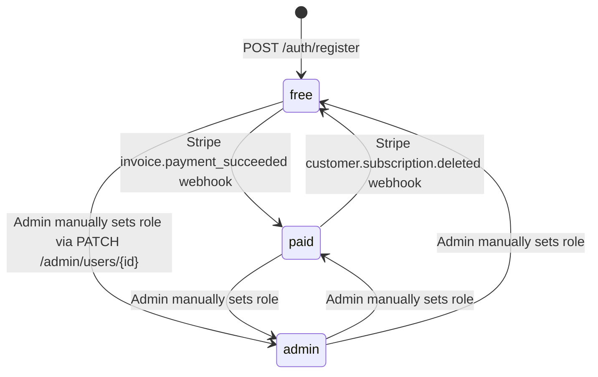
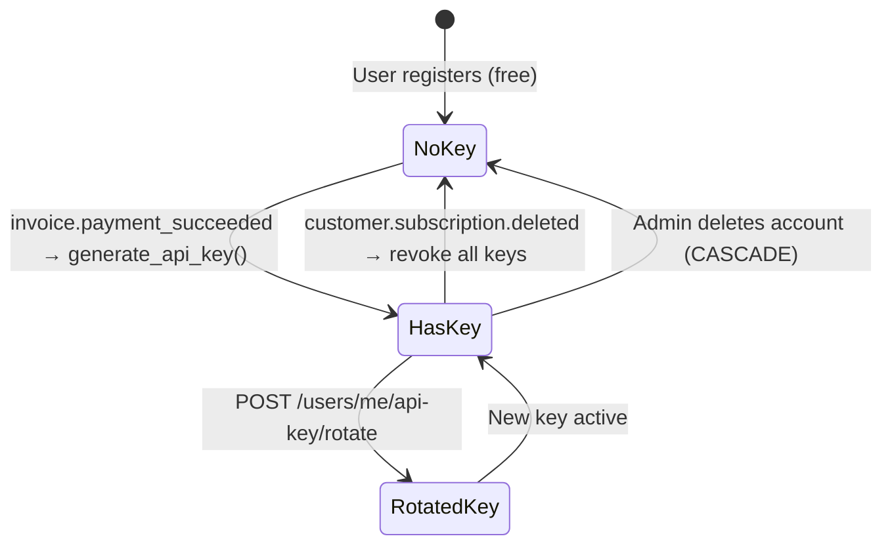

# Role-Based Access Control (RBAC)

!!! success "Phase 4"
    RBAC is fully implemented via FastAPI `Depends` functions in
    `src/backend/auth/dependencies.py`.

---

## Role Matrix

| Feature | Unauthenticated | `free` | `paid` | `admin` |
|---|:---:|:---:|:---:|:---:|
| Landing page & API docs | ✅ | ✅ | ✅ | ✅ |
| `GET /companies/**` | ✅ | ✅ | ✅ | ✅ |
| `GET /financials/**` | ✅ | ✅ | ✅ | ✅ |
| `POST /auth/**` | ✅ | ✅ | ✅ | ✅ |
| `GET /users/me` | ❌ | ✅ | ✅ | ✅ |
| Account settings (`/account`) | ❌ | ✅ | ✅ | ✅ |
| `POST /search` | ❌ | ❌ | ✅ | ✅ |
| `GET /users/me/api-key` | ❌ | ❌ | ✅ | ✅ |
| `POST /users/me/api-key/rotate` | ❌ | ❌ | ✅ | ✅ |
| Paid dashboard (`/dashboard/**`) | ❌ | ❌ | ✅ | ✅ |
| `GET /admin/users` | ❌ | ❌ | ❌ | ✅ |
| `PATCH/DELETE /admin/users/{id}` | ❌ | ❌ | ❌ | ✅ |
| Admin dashboard (`/admin/dashboard`) | ❌ | ❌ | ❌ | ✅ |

---

## Dependency Functions

All enforcement is done at the FastAPI layer via `Depends` callables.
The frontend middleware is an additional UX guard only.

### `get_current_user`

Reads the `access_token` HttpOnly cookie, decodes the JWT, and returns the
active `User` ORM object.  Raises HTTP 401 if the token is missing, expired,
or invalid.

```python
from auth.dependencies import get_current_user

@router.get("/users/me")
def me(user: User = Depends(get_current_user)):
    return {"email": user.email, "role": user.role}
```

### `require_role(*roles)`

Returns a dependency that calls `get_current_user` and then checks the
user's `role` against the allowed set.  Raises HTTP 403 if the role is
not permitted.

```python
from auth.dependencies import require_role

@router.get("/admin/users")
def admin_list(user: User = Depends(require_role("admin"))):
    ...

@router.get("/users/me/api-key")
def api_key_info(user: User = Depends(require_role("paid", "admin"))):
    ...
```

### `get_api_key_user`

Reads the `X-API-Key` request header, hashes it with SHA-256, and looks
it up in the `api_keys` table.  Returns the owning `User`.  Raises HTTP 401
if missing or revoked.

```python
from auth.dependencies import get_api_key_user

@router.get("/data")
def protected_data(user: User = Depends(get_api_key_user)):
    ...
```

### `require_api_key_or_session`

Accepts **either** a valid session cookie or a valid `X-API-Key` header.
Used on the `POST /search` endpoint to support both browser and programmatic
access.  The resolved user must have `paid` or `admin` role.

```python
from auth.dependencies import require_api_key_or_session

@router.post("/search")
def search(
    payload: SearchRequest,
    db: Session = Depends(get_db),
    _user: User = Depends(require_api_key_or_session),
):
    ...
```

---

## Role Lifecycle



Role transitions happen:
1. **Automatically** via Stripe webhook events.
2. **Manually** by an `admin` user via `PATCH /admin/users/{id}`.

---

## API Key Lifecycle



The raw key is returned **once** — only the SHA-256 hash is stored.
