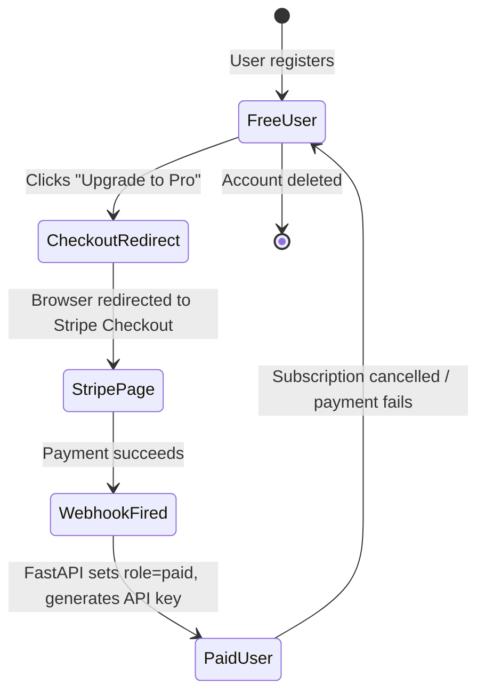

# Stripe Integration

!!! success "Phase 4"
    Stripe Checkout and webhook handling are implemented in Phase 4.

---

## Overview

FinSight uses Stripe for subscription billing.  The integration has two
components:

1. **Checkout** — The frontend creates a Stripe Checkout Session via the
   Next.js BFF and redirects the browser to the hosted Stripe payment page.
2. **Webhook** — After a successful payment, Stripe calls the FastAPI webhook
   endpoint, which upgrades the user's role and generates their API key.

---

## Subscription Lifecycle



---

## Checkout Flow

### 1. Frontend — Create Checkout Session

The `/upgrade` page calls the BFF route `POST /api/stripe/checkout`:

```typescript
// frontend/src/app/api/stripe/checkout/route.ts
const session = await stripe.checkout.sessions.create({
  mode: "subscription",
  payment_method_types: ["card"],
  customer_email: user.email,
  line_items: [{ price: PRO_PRICE_ID, quantity: 1 }],
  success_url: `${APP_URL}/account?upgraded=true`,
  cancel_url:  `${APP_URL}/upgrade?cancelled=true`,
  metadata: { user_email: user.email },
});
return NextResponse.json({ checkout_url: session.url });
```

The browser is then redirected to `session.url` (a `https://checkout.stripe.com/…` URL).

### 2. User Completes Payment

Stripe's hosted page collects card details.  FinSight never touches payment
information — Stripe handles PCI compliance.

### 3. Redirect Back

On success, Stripe redirects to `APP_URL/account?upgraded=true`.
On cancellation, to `APP_URL/upgrade?cancelled=true`.

---

## Webhook Handler

Stripe fires `POST /webhooks/stripe` after every subscription event.
The backend verifies the `Stripe-Signature` header before processing.

### Signature Verification

```python
event = stripe.Webhook.construct_event(
    payload=payload,          # raw request body (bytes)
    sig_header=stripe_signature,
    secret=STRIPE_WEBHOOK_SECRET,
)
```

**Never skip signature verification.**  Without it, any HTTP client could
spoof payment events and grant paid access for free.

### Handled Events

| Event | Action |
|---|---|
| `invoice.payment_succeeded` | Set `user.role = "paid"`, revoke old API keys, generate new API key |
| `customer.subscription.deleted` | Set `user.role = "free"`, revoke all API keys |

All other event types are acknowledged (`200 OK`) but not acted upon.

### `invoice.payment_succeeded` Handler

```python
def _upgrade_user_to_paid(customer_id: str, subscription_id: str, db: Session):
    user = db.query(User).filter(User.stripe_customer_id == customer_id).first()
    user.role = "paid"
    user.stripe_subscription_id = subscription_id
    # Revoke old keys, issue new one
    db.query(APIKey).filter(APIKey.user_id == user.id, ...).update({"revoked": True})
    raw_key, key_hash, key_prefix = generate_api_key()
    db.add(APIKey(user_id=user.id, key_hash=key_hash, key_prefix=key_prefix))
    db.commit()
```

---

## Local Development Setup

### 1. Install Stripe CLI

```bash
brew install stripe/stripe-cli/stripe
stripe login
```

### 2. Forward Webhooks to Local Backend

```bash
stripe listen --forward-to localhost:8000/webhooks/stripe
```

The CLI prints a temporary `STRIPE_WEBHOOK_SECRET` — add it to `.env`.

### 3. Trigger a Test Event

```bash
stripe trigger invoice.payment_succeeded
```

---

## Environment Variables

| Variable | Where | Description |
|---|---|---|
| `STRIPE_SECRET_KEY` | Backend + Frontend BFF | Stripe secret key (`sk_test_…` or `sk_live_…`) |
| `STRIPE_WEBHOOK_SECRET` | Backend only | Webhook signing secret from Stripe CLI or dashboard |
| `STRIPE_PRO_PRICE_ID` | Frontend BFF only | Stripe Price ID for the MYR 29/mo subscription |
| `NEXT_PUBLIC_APP_URL` | Frontend BFF only | Base URL for success/cancel redirects |

---

## Stripe Dashboard Setup

1. Create a **Product** named "FinSight Pro".
2. Add a **Recurring Price** — MYR 29.00 / month.
3. Copy the **Price ID** (`price_…`) → set as `STRIPE_PRO_PRICE_ID`.
4. Under **Webhooks**, add an endpoint for:
   - URL: `https://finsight-api.onrender.com/webhooks/stripe`
   - Events: `invoice.payment_succeeded`, `customer.subscription.deleted`
5. Copy the **Signing Secret** → set as `STRIPE_WEBHOOK_SECRET`.
