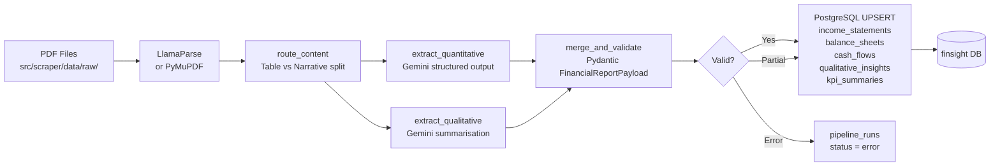

# ETL Pipeline

!!! success "Phase 2 — Implemented"
    The full automated ETL pipeline — PDF ingestion → AI-driven parsing → PostgreSQL UPSERT — is live in Phase 2.  
    Orchestrated by **Apache Airflow** (LocalExecutor), powered by **LangGraph + Google Gemini**, and traced end-to-end with **Langfuse**.

---

## Overview

The FinSight ETL pipeline converts raw quarterly/annual report PDFs downloaded by the Phase 1 scraper into structured financial data stored in PostgreSQL.

```
Scraper (Phase 1)          ETL Pipeline (Phase 2)
──────────────────         ─────────────────────────────────────────────────
Playwright → PDF           Airflow DAG
  src/scraper/             ├── check_new_pdfs      — scan for unprocessed PDFs
  data/raw/<TICKER>/       ├── trigger_parse_pipeline
    *.pdf                  │     └── LangGraph state machine
                           │           parse_pdf → route_content
                           │             ├── extract_quantitative  (Gemini)
                           │             └── extract_qualitative   (Gemini)
                           │                   └── merge_and_validate
                           └── load_to_postgres   — UPSERT to finsight DB
```

---

## Pipeline Diagram



---

## Orchestration

### Airflow DAG — `dags/finsight_etl_dag.py`

| Property | Value |
|---|---|
| DAG ID | `finsight_etl` |
| Schedule | `@daily` |
| Executor | `LocalExecutor` |
| Retries | 3 × 5-minute delay |
| Start date | 2025-01-01 (catchup=False) |

**Task graph:**

```
check_new_pdfs >> trigger_parse_pipeline >> load_to_postgres
```

| Task | Operator | What it does |
|---|---|---|
| `check_new_pdfs` | `PythonOperator` | Scans `FINSIGHT_RAW_DIR` for PDFs not yet in `pipeline_runs` with `status='success'`. Pushes list via XCom. |
| `trigger_parse_pipeline` | `PythonOperator` | Runs `pipeline.graph.run_pipeline(pdf_path)` for each unprocessed PDF. Pushes validated JSON payloads via XCom. |
| `load_to_postgres` | `PythonOperator` | Calls `db.loader.upsert_report(payload)` for each payload; marks files as `success` or `error` in `pipeline_runs`. |

---

## Transform Logic

### LangGraph State Machine — `src/pipeline/`

The pipeline uses a **LangGraph StateGraph** (engine toggle: `PIPELINE_ENGINE=langgraph|dify`).

```python
# graph.py
parse_pdf → route_content → [extract_quantitative, extract_qualitative] → merge_and_validate
```

| Node | File | Description |
|---|---|---|
| `parse_pdf` | `nodes/parser.py` | Calls LlamaCloud async API (`tier=agentic`) → Markdown. Falls back to PyMuPDF if API unavailable. Derives ticker/year/period from filename. |
| `route_content` | `nodes/router.py` | Regex heuristic splits Markdown into `table_markdown` (financial tables) and `narrative_markdown` (MD&A, outlook). |
| `extract_quantitative` | `nodes/quantitative.py` | Gemini `with_structured_output()` extracts Income Statement, Balance Sheet, Cash Flow, KPI Summary. All values in **MYR billions**. Langfuse callback attached. |
| `extract_qualitative` | `nodes/qualitative.py` | RecursiveCharacterTextSplitter + Gemini summarisation → `future_outlook` string + `key_strategic_events` JSON array. Langfuse callback attached. |
| `merge_and_validate` | `nodes/merger.py` | Assembles `FinancialReportPayload` Pydantic model. On validation error, appends to `errors` and returns partial payload. |

### Financial Data Normalisation

- All monetary values are extracted in **MYR billions** (e.g., 12,345 MYR million → 12.345)
- Fiscal year derived from filename `{TICKER}_{YEAR}_{QUARTER}.pdf`
- Percentages stored as 0–100 (not 0–1)
- `key_strategic_events` stored as a JSON-serialised string in PostgreSQL

### Deduplication / Idempotency

All financial tables use `ON CONFLICT (ticker, fiscal_year) DO UPDATE` so re-running the pipeline never creates duplicates.

The `pipeline_runs` tracking table records:

```sql
CREATE TABLE pipeline_runs (
    id          SERIAL PRIMARY KEY,
    pdf_path    TEXT        NOT NULL UNIQUE,
    status      VARCHAR(20) NOT NULL DEFAULT 'pending',  -- pending | processing | success | error
    ticker      VARCHAR(20),
    fiscal_year INTEGER,
    run_at      TIMESTAMPTZ NOT NULL DEFAULT NOW(),
    error_msg   TEXT
);
```

### Incremental Loading

Only PDFs absent from `pipeline_runs WHERE status='success'` are processed each DAG run.

---

## Engine Toggle — LangGraph vs Dify

Set `PIPELINE_ENGINE` in `.env`:

| Value | Behaviour |
|---|---|
| `langgraph` (default) | Full LangGraph state machine: Router → Quant/Qual → Merge |
| `dify` | Skips LangGraph nodes; sends parsed Markdown to a Dify Workflow API endpoint (`DIFY_API_URL`) and maps the JSON response to the DB loader |

Dify client lives at `src/pipeline/dify_client.py`.

---

## Docker Setup

Airflow runs in a **separate** `docker-compose.airflow.yml` so it never interferes with the main `docker-compose.yml` (postgres + backend + frontend).

```
docker compose up -d                                 # main stack (postgres:5432, backend, frontend)
docker compose -f docker-compose.airflow.yml up --build   # Airflow (postgres-airflow:5433, UI:8080)
```

Airflow services:

| Service | Port | Notes |
|---|---|---|
| `postgres-airflow` | 5433 | Airflow metadata DB — isolated from finsight DB |
| `airflow-init` | — | One-shot: runs `airflow db migrate` + creates admin user |
| `airflow-webserver` | 8080 | UI at http://localhost:8080 (admin/admin) |
| `airflow-scheduler` | — | Picks up and executes DAG runs |

The Airflow containers mount `./dags` and `./src` as volumes and set `PYTHONPATH=/app/src` so `pipeline.*` and `db.*` imports work transparently.

---

## Monitoring and Alerting

- **Langfuse** traces every LLM call (model, prompt, tokens, latency) at https://cloud.langfuse.com
- **Airflow UI** (http://localhost:8080) shows per-task status, logs, XCom values, and retry history
- **`pipeline_runs` table** provides SQL-queryable run history:
  ```sql
  SELECT * FROM pipeline_runs ORDER BY run_at DESC LIMIT 20;
  ```
- Set `email_on_failure=True` in `DEFAULT_ARGS` (DAG file) and configure Airflow SMTP for alerts

---

## Data Lineage

Every DB row is traceable via:

1. `pipeline_runs.pdf_path` → source PDF
2. `pipeline_runs.run_at` → ingestion timestamp
3. Langfuse trace → full LLM prompt/response for that PDF

---

## Local Development Quickstart

```bash
# 1. Install pipeline deps
pip install -r src/pipeline/requirements.txt

# 2. Copy and fill in .env
cp .env.example .env

# 3. Smoke test (no DB or LLM needed)
python tests/test_pipeline.py --smoke

# 4. Run pipeline on a single PDF (requires GOOGLE_API_KEY + DATABASE_URL)
python -m pipeline.graph --pdf src/scraper/data/raw/MAYBANK/MAYBANK_2024_Q3.pdf

# 5. Integration test (DB + LLM + real PDF)
python tests/test_pipeline.py --integration --pdf src/scraper/data/raw/MAYBANK/MAYBANK_2024_Q3.pdf

# 6. Watch mode: auto-run when any new PDF appears
python tests/test_pipeline.py --watch

# 7. Start Airflow locally
docker compose -f docker-compose.airflow.yml up --build
```
