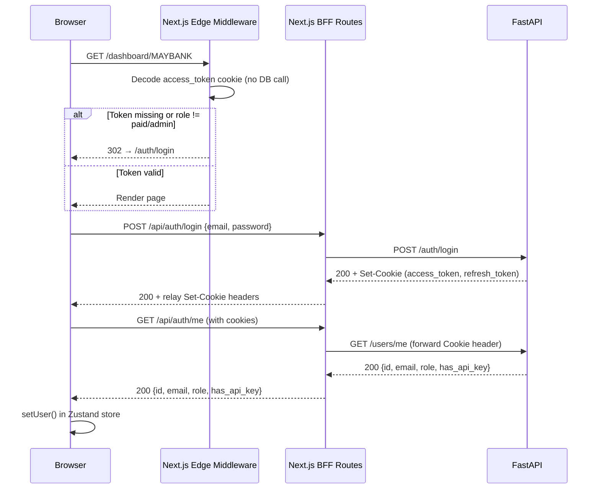

# Frontend Architecture

!!! success "Phase 4 Live"
    Full authentication, RBAC-protected routes, paid dashboards, and Stripe
    integration are implemented in Phase 4.  The basic public site from Phase 1
    remains fully functional.

---

## Tech Stack

| Library | Purpose |
|---|---|
| Next.js 16 (App Router) | React framework, SSR / SSG / Edge middleware |
| TypeScript | Type safety across all components and API shapes |
| Zustand | Client-side global state (auth user, UI preferences) |
| TanStack Query v5 | Server state, caching, and mutation handling |
| Recharts | Financial chart visualizations (free and paid tier) |
| Tailwind CSS v4 | Utility-first styling |
| Stripe.js | Stripe Checkout redirect for subscription upgrade |

---

## Project Structure

```
frontend/src/
├── app/
│   ├── page.tsx                          # Landing page (SSG)
│   ├── layout.tsx                        # Root layout — auth hydration
│   ├── not-found.tsx                     # 404 page
│   ├── auth/
│   │   ├── login/page.tsx                # Login form
│   │   └── register/page.tsx             # Registration + one-time password modal
│   ├── companies/
│   │   ├── page.tsx                      # Company listing (SSG)
│   │   └── [id]/page.tsx                 # Company profile with free-tier charts (ISR)
│   ├── dashboard/
│   │   ├── page.tsx                      # Paid overview — company grid (CSR)
│   │   └── [ticker]/page.tsx             # Per-company paid analytics (CSR)
│   ├── account/page.tsx                  # Account settings + API key (CSR)
│   ├── upgrade/page.tsx                  # Pricing cards + Stripe redirect (CSR)
│   ├── admin/
│   │   └── dashboard/page.tsx            # Admin user management (CSR)
│   └── api/                              # Next.js BFF route handlers
│       ├── auth/
│       │   ├── register/route.ts         # POST /api/auth/register
│       │   ├── login/route.ts            # POST /api/auth/login
│       │   ├── logout/route.ts           # POST /api/auth/logout
│       │   └── me/route.ts               # GET  /api/auth/me
│       ├── companies/route.ts            # GET  /api/companies
│       ├── companies/[id]/route.ts       # GET  /api/companies/{ticker}
│       ├── financials/[id]/route.ts      # GET  /api/financials/{ticker}
│       ├── users/api-key/route.ts        # GET + POST /api/users/api-key
│       ├── admin/users/route.ts          # GET  /api/admin/users
│       ├── admin/users/[id]/route.ts     # PATCH + DELETE /api/admin/users/{id}
│       └── stripe/checkout/route.ts      # POST /api/stripe/checkout
├── components/
│   ├── charts/
│   │   ├── RevenueTrendChart.tsx         # Free: dual-line revenue & net income
│   │   ├── IncomeBarChart.tsx            # Free: grouped bar income breakdown
│   │   ├── MarginChart.tsx               # Free: area chart profitability margins
│   │   ├── SentimentOverlayChart.tsx     # PAID: AI sentiment + revenue composed chart
│   │   ├── PeerRadarChart.tsx            # PAID: 5-axis radar vs peers
│   │   └── WaterfallChart.tsx            # PAID: revenue-to-net-income waterfall
│   ├── tables/
│   │   └── FinancialsTable.tsx           # Income statement with YoY deltas
│   ├── ui/
│   │   ├── KPICard.tsx                   # Metric card with value and YoY delta
│   │   ├── CompanyCard.tsx               # Company tile for listings
│   │   ├── Skeleton.tsx                  # Loading skeleton variants
│   │   └── Badge.tsx                     # Status / sector badge
│   └── layout/
│       ├── Header.tsx                    # Sticky nav with auth-aware links
│       └── Footer.tsx                    # Site footer
├── hooks/
│   ├── useCompanies.ts                   # TanStack Query: company data
│   ├── useFinancials.ts                  # TanStack Query: income statement
│   └── useAuth.ts                        # TanStack Query: auth mutations + currentUser
├── stores/
│   ├── searchStore.ts                    # Zustand: ticker search state
│   └── authStore.ts                      # Zustand: auth user, role, hydration
├── lib/
│   ├── api.ts                            # Centralised BFF fetch client
│   ├── utils.ts                          # Formatters, colour helpers, YoY calc
│   └── providers.tsx                     # TanStack QueryClientProvider wrapper
├── types/
│   └── index.ts                          # TypeScript interfaces for all API shapes
└── middleware.ts                          # Edge middleware — route protection
```

---

## Authentication Flow



---

## Rendering Strategy

| Route | Strategy | Reason |
|---|---|---|
| Landing page (`/`) | SSG | Static content, CDN-cached |
| Company listing (`/companies`) | SSG | Infrequently changing list |
| Company profiles (`/companies/[id]`) | ISR (1 hr) | Refreshes on new filing |
| Auth pages (`/auth/**`) | CSR | No sensitive server-side work |
| Paid dashboard (`/dashboard/**`) | CSR | Auth-gated, dynamic data |
| Account settings (`/account`) | CSR | Session-dependent |
| Admin dashboard (`/admin/**`) | CSR | Real-time user data |
| AI chat | CSR | Streaming responses (Phase 5) |

---

## Deployment

### Frontend → Vercel

The frontend is deployed to Vercel via GitHub Actions on every push to `main`
that touches `frontend/**`.

**Workflow:** `.github/workflows/deploy-frontend.yml`

**Required GitHub Secrets:**

| Secret | Description |
|---|---|
| `VERCEL_TOKEN` | Vercel personal access token |
| `VERCEL_ORG_ID` | Vercel team/org ID |
| `VERCEL_PROJECT_ID` | Vercel project ID |
| `NEXT_PUBLIC_API_URL` | Public FastAPI URL |
| `INTERNAL_API_URL` | Server-side FastAPI URL |
| `STRIPE_SECRET_KEY` | Stripe secret key (for BFF checkout) |
| `STRIPE_PRO_PRICE_ID` | Stripe price ID for MYR 29/mo plan |
| `NEXT_PUBLIC_APP_URL` | Frontend URL for Stripe redirects |

### Backend → Render

See `docs/backend/fastapi-architecture.md` for backend deployment details.
