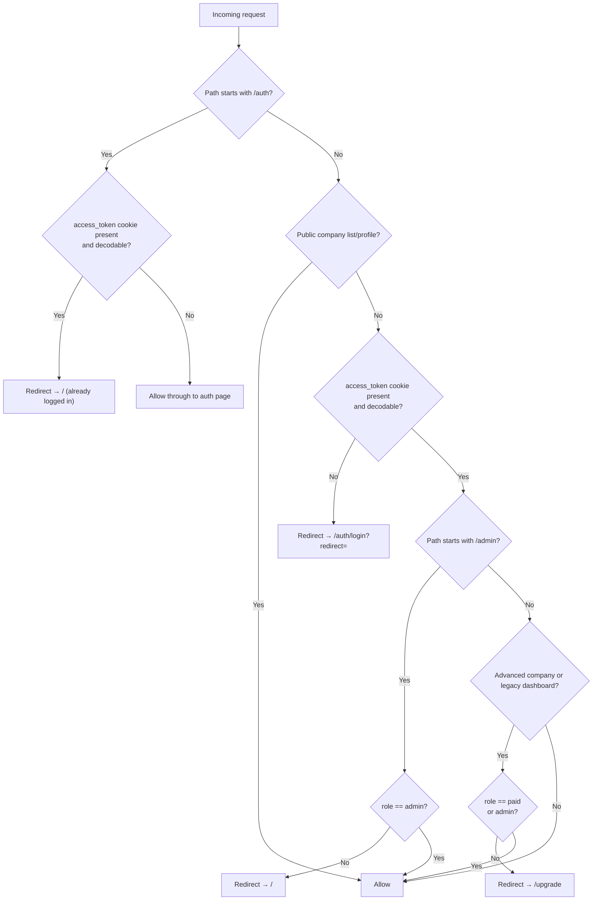

# Routing & Middleware

This document covers the Next.js routing structure, the Edge Middleware
access-control strategy, and the redirect rules that enforce authentication
and role-based access across the application.

---

## Route Map

| Route | Public | Min. Role | Notes |
|---|:---:|---|---|
| `/auth/login` | ✅ | — | Redirects to `/` if already authenticated |
| `/auth/register` | ✅ | — | Redirects to `/` if already authenticated |
| `/api/**` | ✅ | — | BFF route handlers; auth enforced per-handler |
| `/` | ❌ | `free` | Authenticated main hub; role-aware content |
| `/companies` | ✅ | — | Public company listing |
| `/companies/[id]` | ✅ | — | Public company profile + free-tier charts |
| `/companies/[id]/advanced` | ❌ | `paid` | Per-company advanced analytics |
| `/account` | ❌ | `free` | Account settings + API key management |
| `/upgrade` | ❌ | `free` | Pricing cards + Stripe Checkout redirect |
| `/dashboard/[ticker]` | ❌ | `paid` | Legacy redirect to `/companies/[ticker]/advanced` |
| `/admin/dashboard` | ❌ | `admin` | User management table |

---

## Edge Middleware

**File:** `frontend/src/middleware.ts`

The Next.js Edge Middleware runs _before_ any page is rendered, at the
network edge (CDN layer on Vercel).  It inspects the `access_token` HttpOnly
cookie on every incoming request to enforce access control without an
additional round-trip to the origin server.

### Matcher

```ts
export const config = {
  matcher: ["/((?!api|_next/static|_next/image|favicon.ico).*)"],
};
```

The negative-lookahead excludes:

| Excluded prefix | Reason |
|---|---|
| `/api/**` | BFF route handlers manage their own auth |
| `/_next/static/**` | Next.js compiled JS/CSS assets |
| `/_next/image/**` | Image optimisation service |
| `/favicon.ico` | Static asset |

Every other path — including `/`, `/companies/**`, `/dashboard/**`, etc. —
is intercepted by the middleware before rendering.

### Decision Flow



### JWT Decoding (No Signature Verification)

The Edge Runtime does not have access to the `SECRET_KEY` used to sign JWTs.
The middleware **decodes** the payload (base64url) without verifying the
signature:

```ts
function decodeJwtPayload(token: string): Record<string, unknown> | null {
  try {
    const parts = token.split(".");
    if (parts.length !== 3) return null;
    const payload = parts[1].replace(/-/g, "+").replace(/_/g, "/");
    return JSON.parse(atob(payload));
  } catch {
    return null;
  }
}
```

!!! warning "Security boundary"
    The middleware is a **UX guard** only.  A tampered token that carries a
    forged `role` claim could bypass the middleware redirect.  The real
    security boundary is FastAPI: every API call that requires elevated
    access verifies the JWT signature server-side using the `SECRET_KEY`.
    Tampering with the token's role will not grant API access.

---

## Post-Login Redirect

After a successful login the `useLogin` mutation redirects to `/`:

```ts
// hooks/useAuth.ts
onSuccess: (user) => {
  setUser(user);
  queryClient.setQueryData(authQueryKeys.currentUser(), user);
  router.push("/");   // → main authenticated hub
},
```

If the middleware intercepted an unauthenticated request it appends a
`redirect` query parameter to `/auth/login`.  The login page can read this
parameter to send the user back to their original destination after
authentication.

---

## Auth Page Guard

Authenticated users who visit `/auth/login` or `/auth/register` (e.g. by
typing the URL manually) are immediately redirected to `/`:

```ts
if (pathname.startsWith("/auth")) {
  if (isAuthenticated) {
    url.pathname = "/";
    return NextResponse.redirect(url);
  }
  return NextResponse.next();
}
```

This prevents a logged-in user from accidentally registering a second account
or seeing the login form unnecessarily.

---

## BFF Route Authentication

Next.js API route handlers (`/api/**`) are excluded from the middleware
matcher but perform their own auth checks by forwarding the `Cookie` header
to FastAPI:

```ts
// Example BFF handler
const res = await fetch(`${INTERNAL_API_URL}/users/me`, {
  headers: { Cookie: req.headers.get("cookie") ?? "" },
});
```

FastAPI's `get_current_user` dependency then verifies the JWT signature and
role before processing the request.

---

## Adding a New Protected Route

1. No middleware change is needed — the catch-all matcher already intercepts
   every non-excluded path.
2. If the route requires a specific role beyond `free`, add a check in
   `middleware.ts` after the global auth gate:

```ts
if (pathname.startsWith("/your-new-route")) {
  if (role !== "paid" && role !== "admin") {
    url.pathname = "/upgrade";
    return NextResponse.redirect(url);
  }
}
```

3. Add the route to the BFF handler (if it needs a backend call) and protect
   the FastAPI endpoint with `Depends(require_role("paid", "admin"))`.
