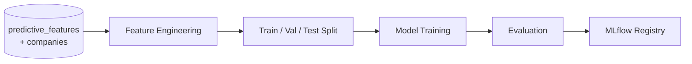

# Model Training

!!! info "Phase 6 — In Progress"
    ML model training on financial datasets is the focus of **Phase 6**
    (Weeks 21–24).  The **feature engineering pipeline is implemented** —
    19 of 21 predictive metrics are computed weekly into the
    `predictive_features` table (metrics 19–20 are schema-only for now).
    Model training and MLflow integration are the next step.

---

## Overview

FinSight trains models to predict forward financial outcomes (e.g. next-quarter
EPS beat, revenue growth direction) using the structured feature matrix in
`predictive_features` joined with company metadata from `companies`.

The feature pipeline is documented in [ML Features ETL](../data-engineering/ml-features-etl.md).

---

## Problem Formulation

### Task Definition

Supervised classification or regression on quarterly KLSE company observations.
Example targets:

- **Classification:** Will the company beat consensus EPS next quarter?
- **Regression:** Predict next-quarter revenue YoY growth rate.

### Target Variable

To be defined during Phase 6 experimentation.  Candidate labels derived from
Phase 3 metrics already in `predictive_features`:

- `revenue_beat_rate_8q` / `eps_beat_rate_8q` (historical beat frequency)
- Forward `revenue_yoy_growth_pct` shifted one quarter ahead

### Feature Set — 21 metrics in `predictive_features`

| # | Column | Phase | Description |
|---|--------|-------|-------------|
| 1 | `revenue_beat_rate_8q` | 3 | Revenue beat rate (last 8 quarters) |
| 2 | `eps_beat_rate_8q` | 3 | EPS beat rate (last 8 quarters) |
| 3 | `avg_revenue_surprise_pct` | 3 | Mean revenue surprise % |
| 4 | `avg_eps_surprise_pct` | 3 | Mean EPS surprise % |
| 5 | `consecutive_double_beat_quarters` | 3 | Consecutive double-beat streak |
| 6 | `net_institutional_cash_flow_myr` | 4 | Net institutional flow (MYR) |
| 7 | `institutional_flow_to_market_cap_ratio` | 4 | Flow / market cap ratio |
| 8 | `net_insider_trading_value_myr` | 4 | Net insider trading (MYR) |
| 9 | `options_iv_rank_pct` | 4 | Warrant IV percentile rank |
| 10 | `revenue_yoy_growth_pct` | 1 | Revenue YoY growth % |
| 11 | `net_income_yoy_growth_pct` | 1 | Net income YoY growth % |
| 12 | `gross_margin_delta_qoq_pct` | 1 | Gross margin delta QoQ (pp) |
| 13 | `operating_margin_delta_qoq_pct` | 1 | Operating margin delta QoQ (pp) |
| 14 | `fcf_yield_pct` | 1 | FCF yield % |
| 15 | `forward_pe_peer_zscore` | 2 | Forward PE z-score vs peers |
| 16 | `forward_pe_peer_discount_pct` | 2 | Forward PE discount vs peers % |
| 17 | `forward_ps_ratio` | 2 | Forward P/S ratio |
| 18 | `peg_ratio` | 2 | PEG ratio |
| 19 | `guidance_beat_indicator` | 5 | Guidance/KPI beat (boolean) — **not yet populated** |
| 20 | `backlog_order_book_yoy_growth_pct` | 5 | Backlog YoY growth % — **not yet populated** |
| 21 | `sector_peer_earnings_sentiment` | 5 | Sector peer beat-rate average (revenue beat, EPS fallback) |

Additional context features from `companies`: `sector`, `industry`,
`market_cap_bln`.

---

## Models

### Baseline — XGBoost

Tabular baseline on the 21-metric feature matrix.  Handles missing values
naturally and provides feature importance for interpretability.

### Deep Learning — PyTorch

Optional neural network for tabular data with sector embeddings, or LSTM over
quarterly time series when multiple `(fiscal_year, fiscal_quarter)` rows per
ticker are stacked.

---

## Training Pipeline



Export training data:

```sql
SELECT pf.*, c.sector, c.industry, c.market_cap_bln
FROM predictive_features pf
JOIN companies c ON c.ticker = pf.ticker
WHERE pf.fiscal_year >= 2020;
```

---

## Dataset

- **Observations:** `(ticker, fiscal_year, fiscal_quarter)` rows from
  `predictive_features`
- **Split strategy:** Time-based — train on older quarters, validate on recent,
  test on hold-out tickers or most recent quarter
- **Missing values:** Some phases may return NULL for unavailable metrics;
  metrics 19–20 are always NULL until PDF extraction is implemented; impute or
  use tree models that handle sparsity

---

## Evaluation Metrics

| Metric | Description |
|---|---|
| Accuracy / F1 | Classification quality (beat/miss prediction) |
| MAE / RMSE | Regression error on growth rates |
| AUC-ROC | Ranking quality for binary targets |

---

## Reproducibility

- Feature pipeline version tracked in `source_metadata` JSON per row
- Random seed fixing in training scripts
- Docker training environment (TBD in Phase 6)
- MLflow experiment tracking — see [Experiment Tracking](experiment-tracking.md)
